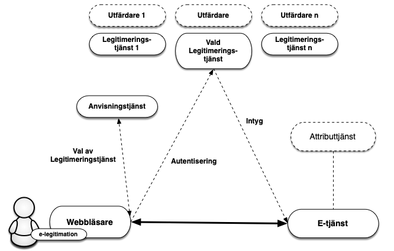
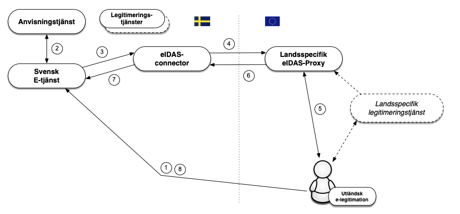

</img>
</img>

</img>

# En introduktion till Sweden Connect Tekniskt ramverk

### 2024-12-02

Diarienummer: **2019-267**

---

Copyright &copy; <a href="https://www.digg.se">Myndigheten för digital förvaltning (Digg)</a>, 2015-2024.

## Innehållsförteckning

1. [**Introduktion**](#introduktion)

    1.1. [Översikt](#oeversikt)

    1.2. [Tillitsramverk och säkerhetsnivåer](#tillitsramverk-och-saekerhetsnivaaer)

    1.3. [Tjänst för insamling, administration och publicering av metadata](#tjaenst-foer-insamling-administration-och-publicering-av-metadata)

    1.4. [Anvisningstjänst](#anvisningstjaenst)

    1.5. [Integration hos förlitande part](#integration-hos-foerlitande-part)

    1.6. [Underskrift](#underskrift)

    1.7. [Tekniskt ramverk och eIDAS](#tekniskt-ramverk-och-eidas)

    1.7.1. [Autentiseringar med utländska e-legitimationer](#autentiseringar-med-utlaendska-e-legitimationer)

    1.7.2. [Underskrifter med utländska e-legitimationer](#underskrifter-med-utlaendska-e-legitimationer)

    1.7.3. [Hantering av identiteter](#hantering-av-identiteter)

    1.7.4. [Svenska e-legitimationer i utländska e-tjänster](#svenska-e-legitimationer-i-utlaendska-e-tjaenster)

2. [**Tekniska specifikationer**](#tekniska-specifikationer)

    2.1. [Profiler och specifikationer för SAML](#profiler-och-specifikationer-for-saml)
    
    2.1.1. [Deployment Profile for the Swedish eID Framework](#deployment-profile-for-the-swedish-eid-framework)

    2.1.2. [Swedish eID Framework - Registry for identifiers](#swedish-eid-framework-registry-for-identifiers)
    
    2.1.3. [Attribute Specification for the Swedish eID Framework](#attribute-specification-for-the-swedish-eid-framework)
    
    2.1.4. [Entity Categories for the Swedish eID Framework](#entity-categories-for-the-swedish-eid-framework)

    2.1.5. [eIDAS Constructed Attributes Specification for the Swedish eID Framework](#eidas-constructed-attributes-specification-for-the-swedish-eid-framework)
    
    2.1.6. [Implementation Profile for BankID Identity Providers within the Swedish eID Framework](#bankid-profile)
    
    2.1.7. [Principal Selection in SAML Authentication Requests](#principal-selection-in-saml-authentication-requests)
    
    2.1.8. [User Message Extension in SAML Authentication Requests](#user-message-extension-in-saml-authentication-requests)
    
    2.2. [Profiler och specifikationer för OpenID Connect](#profiler-och-specifikationer-for-openid-connect)
    
    2.2.1. [OpenID Connect Profile for Sweden Connect](#openid-connect-profile-for-sweden-connect)
    
    2.2.2. [OpenID Connect Claims and Scopes Specification for Sweden Connect](#openid-connect-claims-and-scopes-specification-for-sweden-connect)

    2.3. [Specifikationer för Underskrift](#specifikationer-foer-underskrift)
    
    2.3.1. [Implementation Profile for using OASIS DSS in Central Signing Services](#implementation-profile-oasis-dss)
    
    2.3.2. [DSS Extension for Federated Central Signing Services](#dss-extensions)
    
    2.3.3. [Certificate Profile for Certificates Issued by Central Signing Services
](#certificate-profile-css)
    
    2.3.4. [Signature Activation Protocol for Federated Signing](#signature-activation)

3. [**Referenslista**](#referenslista)

    3.1. [DIGG](#digg)

    3.2. [Övriga referenser](#oevriga-referenser)

## 1. Introduktion

### 1.1. Översikt

Sweden Connect Tekniskt Ramverk är anpassat för
identitetsfederationer som baseras på SAML 2.0.

> I den senaste versionen av Tekniskt ramverk har även specifikationer för OpenID Connect introducerats. För närvarande finns inget federationsstöd för OpenID Connect. Detta kommer att introduceras under 2025. 

> Resterande delar av detta dokument beskriver endast SAML-federationen. Då OpenID Connect introduceras fullt ut kommer även detta dokument att beskriva denna teknik. 

Förlitande parter erhåller identitetsintyg i ett standardiserat format
från en legitimeringstjänst1.

E-tjänster som kräver underskrift behöver inte anpassas efter olika 
användares e-legitimationer för att skapa elektroniska underskrifter. 
Istället överlåter e-tjänsten detta till en underskriftstjänst där användare 
med stöd av legitimering via en legitimeringstjänst ges möjlighet att underteckna
elektroniska handlingar.

Inom federationen intar e-tjänster och motsvarande förlitande parter
rollen som Service Provider (SP) medan legitimeringstjänster som
utfärdar identitetsintyg intar rollen som Identity Provider (IdP) och
därmed den som autentiserar användaren, oavsett mot vilken e-tjänst som
användaren legitimerar sig.

För de fall där e-tjänsten behöver mer information om användaren t ex.
uppgift om juridisk behörighet, kan en fråga ställas till en
attributtjänst, Attribute Authority (AA), inom federationen, om sådan
relevant attributtjänst finns. Genom en attributsförfrågan kan
e-tjänsten erhålla nödvändig kompletterande information för att kunna
auktorisera användaren och ge tillgång till e-tjänsten eller
motsvarande.

Då såväl personidentitetsuppgifter som andra attribut kopplat till
användare tillhandahålls genom identitetsintyg och attributsintyg, kan
alla typer av e-legitimationer som förlitande part har avtal om och som
ingår i federationen användas för legitimering mot en e-tjänst som
kräver såväl personnummer som ytterligare information, även om 
e-legitimationen inte innehåller några specifika personuppgifter 
(t.ex. koddosor för generering av engångslösenord).

Figur 1: *Illustration av kommunikationen mellan de olika tjänsterna inom
en identitetsfederation.*

> \[1\]: Legitimeringstjänst benämns i annan dokumentation från Digg också som identitetstjänst och intygstjänst. I detta dokument används dock uteslutande benämningen legitimeringstjänst.

### 1.2. Tillitsramverk och säkerhetsnivåer

Grunden för vilken säkerhetsnivå som tillämpas när en användare
legitimerar sig är den tillitsnivå avseende e-legitimationen som
e-tjänsten kräver. För att dessa säkerhetsnivåer ska kunna vara
jämförbara inom ramen för federationen definieras fyra tillitsnivåer (1
– 4) i Tillitsramverket för Svensk e-legitimation \[[Digg.Tillit](#digg-tillit)\] och tre
tillitsnivåer (låg, väsentlig, hög) i EU-förordningen eIDAS. Alla som
utfärdar identitetsintyg måste visa att hela den process som ligger till
grund för utfärdandet av identitetsintyg uppfyller kraven i den
efterfrågade tillitsnivån, detta innefattar bl.a.

-   Krav på skapandet av identitetsintyget.

-   Krav på den elektroniska legitimeringen (autentiseringen).

-   Krav på utfärdandeprocessen.

-   Krav på själva e-legitimationen och dess användning.

-   Krav på utfärdaren av e-legitimationen.

-   Krav på fastställande av den e-legitimationssökandens identitet.

### 1.3. Tjänst för insamling, administration och publicering av metadata

En SAML-federation tillhandahåller information om federationens
deltagare genom SAML metadata. Som deltagare i en federation räknas
såväl aktörer som levererar legitimerings- och attributtjänster i
federationen som förlitande parter, d.v.s. aktörer som konsumerar dessa
tjänster, t ex. e-tjänster.

Genom federationens metadata kan deltagare inhämta information om andra
deltagares tjänster, inklusive de uppgifter som krävs för ett säkert
informationsutbyte mellan deltagarna. Metadata måste hållas uppdaterat
av respektive part och överensstämma med avtalade förhållanden.

Det viktigaste syftet med metadata är att tillhandahålla de nycklar/certifikat 
som krävs för säker kommunikation och informationsutväxling mellan tjänster.
Utöver nycklar innehåller metadata även annan information som är viktig
för samverkan mellan tjänster t ex. adresser till funktioner som krävs,
information om tillitsnivåer, tjänstekategorier,
användargränssnittsinformation mm.

En identitetsfederation definieras av ett register i XML-format som är
signerat med federationsoperatörens certifikat. Filen innehåller
information om identitetsfederationens medlemmar inklusive deras
certifikat. Eftersom filen med metadata är signerad räcker det med att
jämföra ett certifikat med dess motsvarighet i metadata. En
infrastruktur baserad på ett centralt federationsregister förutsätter
att registret uppdateras kontinuerligt samt att federationsmedlemmarna
alltid använder den senaste versionen av filen.

### 1.4. Anvisningstjänst

I en identitetsfederation är det möjligt att erbjuda och konsumera en
gemensam anvisningstjänst (Discovery Service), som listar vilka
legitimeringstjänster som är möjliga för användaren att välja mellan.
Syftet med en sådan anvisningstjänst är att avlasta de enskilda
e-tjänsterna som ingår i identitetsfederationen från att själva
implementera stöd för hur användare väljer legitimeringstjänst (eller
inloggningsmetod).

Genom att anvisningstjänsten finns tillgänglig inom
identitetsfederationen kan e-tjänster styra sina användare dit för val
av legitimeringstjänst. Anvisningstjänsten interagerar med användaren
som gör sitt val och användaren, tillsammans med dennes val, styrs
tillbaka till e-tjänsten som nu vet till vilken legitimeringstjänst
användaren ska skickas för legitimering.

> För närvarande finns ingen gemensam anvisningstjänst för Sweden Connect-federationen.

### 1.5. Integration hos förlitande part

Förlitandeparter, t.ex. e-tjänster, integrerar mot legitimeringstjänster
genom standardiserade meddelanden och konsumerar identitetsintyg vilka
också har standardiserade format.

Sweden Connect tekniskt ramverk är influerad av interoperabilitetsprofilen 
”SAML V2.0 Deployment Profile for Federation Interoperability”
\[[SAML2Int](#saml2int)\]. Profilen stöds av ett flertal kommersiella 
produkter och Open Source-lösningar, vilket underlättar integrationsarbetet
hos e-tjänster.

Många e-tjänster använder fristående autentiseringslösningar vilket
innebär att en anpassning av integrationen för att följa
tekniskt ramverk får en begränsad påverkan på e-tjänsten som sådan.

### 1.6. Underskrift

Vid underskrift blir det med Sweden Connect tekniskt ramverk
möjligt att använda olika typer av e-legitimationer, även sådana som
inte är certifikatbaserade, utan att speciella anpassningar i e-tjänsten
behövs. Anledningen är att det är det elektroniskt utställda
identitetsintyget (som används för identifiering av användare vid
underskrift) har samma format oavsett vilken typ av e-legitimation som
användaren använder.

En underskriftstjänst har som syfte att möjliggöra underskrift inom
identitetsfederationer som följer tekniskt ramverk med stöd av alla 
typer av e-legitimationer som erbjuder tillräcklig grad av säkerhet.

Genom att upphandla1 och införa en underskriftstjänst kan en förlitande
part som ingår i federationen låta en användare skriva under en
elektronisk handling med stöd av underskriftstjänsten.
Användarens elektroniska signatur och tillhörande signeringscertifikat
skapas av underskriftstjänsten efter det att användaren accepterat att
skriva under genom att legitimera sig mot underskriftstjänsten2.

> \[1\]: Det är också möjligt att själv implementera en underskriftstjänst baserat på specifikationerna i tekniskt ramverk, eller på annat sätt införskaffa en underskriftstjänst.

> \[2\]: Viktigt att påpeka är att det är av största vikt att användaren upplever det som att denne skriver under en handling. Därför ska ett underskriftsflöde användas för de e-legitimationer som stödjer detta i samband med "legitimering för underskrift".

### 1.7. Tekniskt ramverk och eIDAS

EU-förordningen ([910/2014](http://eur-lex.europa.eu/legal-content/SV/TXT/PDF/?uri=CELEX:32014R0910&from=EN)) om elektronisk identifiering och betrodda
tjänster, eIDAS, ställer krav på svenska offentliga organ att erkänna de
e-legitimationer som andra eIDAS-länder har anmält. Detta innebär att en
offentlig svensk e-tjänst baserat på vissa regler skall kunna acceptera
en inloggning som utförs med en e-legitimation utställd i ett annat
land.

#### 1.7.1. Autentiseringar med utländska e-legitimationer

De tekniska specifikationerna för eIDAS bygger, såsom
tekniskt ramverk, på SAML-standarder, och även
om likheterna är många finns även skillnader i dessa specifikationer. En
svensk e-tjänst ska dock inte förhålla sig direkt till eIDAS tekniska
specifikationer. Nedanstående bild illustrerar hur
den svenska eIDAS-noden (*eIDAS-connector*) agerar som en brygga
mellan andra länder och den svenska federationen då en person autentiseras
med en utländsk e-legitimation mot en svensk e-tjänst.
Den svenska eIDAS-noden följer tekniskt ramverk.

Flödet är enligt följande:

1.  En användare med en utländsk e-legitimation begär åtkomst till en
    svensk e-tjänst (d.v.s., loggar in).
    
2.  E-tjänsten låter användaren välja inloggningssätt med hjälp av en
    anvisningstjänst. Ett val ”Foreign eID” visas upp, vilket användaren
    i eIDAS-fallet väljer.

3.  E-tjänsten skapar en legitimeringsbegäran enligt detta tekniska
    ramverk och styr användaren till den svenska eIDAS-noden (*connector*)
    som DIGG ansvarar för. eIDAS-noden uppträder som
    en legitimeringstjänst (*Identity Provider*) i federationen in
    mot svenska förlitande parter vilket innebär att kommunikation med
    denna tjänst utförs på samma sätt som mot övriga
    legitimeringstjänster inom federationer som följer tekniskt ramverk.

4.  Den mottagna begäran behandlas och eIDAS-noden visar upp en valsida
    där användaren väljer ”sitt land”1. Den svenska eIDAS-noden
    omvandlar nu den mottagna legitimeringsbegäran till en
    legitimeringsbegäran enligt eIDAS och användaren styrs till det
    valda landets ”eIDAS Proxy-tjänst”.

5.  Då legitimeringsbegäran mottas av den eIDAS-Proxy-tjänst för valt
    land tar detta lands teknik för autentisering över. Inte alla länder
    inom eIDAS använder SAML för autentisering, men om så var fallet i
    vårt exempel skulle användaren styras vidare till en
    legitimeringstjänst (*Identity Provider*), och innan dess kanske även
    en anvisningstjänst för val av legitimeringstjänst.

6.  Då en autentisering utförts skapas ett intyg (*Assertion*) enligt
    eIDAS specifikationer. Detta intyg innehåller bl.a. eIDAS-specifika
    attribut som identifierar användaren. Detta intyg styrs nu vidare till
    den svenska eIDAS-noden.

7.  Noden tar emot intyget och validerar dess korrekthet. Detta intyg
    transformeras från eIDAS-format till ett intyg utformat
    enligt tekniskt ramverk och postas till e-tjänsten.
    
9.  Förlitande part kompletterar eventuellt med ytterligare information
    och avgör om användaren ska ges till åtkomst till tjänsten.

Svenska e-tjänster behöver således endast stödja 
tekniskt ramverk för att kunna hantera en autentisering utförd med en
europeisk e-legitimation. Dock måste e-tjänsten kunna hantera den
identitet som presenteras, vilket inte nödvändigtvis är ett personnummer. 
Det kan alltså hända att en e-tjänst autentiserar en användare via 
eIDAS-ramverket, men att användarens
presenterade identitet inte går att använda hos e-tjänsten. Mer om detta
i kapitlet 1.7.3 nedan.

> \[1\]: Egentligen väljer användaren till vilken ”eIDAS Proxy-tjänst” som begäran ska skickas vidare till. Detta är beroende landstillhörigheten för användarens e-legitimationsutfärdare.

#### 1.7.2. Underskrifter med utländska e-legitimationer

Som redan beskrivits tillämpas en modell för
elektronisk underskrift inom ramen för detta tekniska ramverk
som kallas federerad underskrift. En
serverbaserad underskriftstjänst knyts till e-tjänsten som i sin tur
begär underskrift. När en användare skriver under ett dokument skickar
e-tjänsten en underskriftsbegäran till underskriftstjänsten.
Underskriftstjänsten begär därefter att användaren legitimerar sig. I
samband med legitimeringen godkänner användaren underskriften.
Underskriftstjänsten skickar tillbaka uppgifter till e-tjänsten och
därefter lagras underskriftsuppgifterna kopplade till den handling som
har skrivits under.

Detta förfarande möjliggör att skriva under även med utländsk
e-legitimation då underskriftstjänsten kan välja att legitimera
användaren med utländsk e-legitimation i enlighet med förfarandet som
beskrivs ovan i avsnitt 1.7.1.

Vid en underskrift ansvarar i det fallet den svenska eIDAS-noden för att
användaren upplyses om att syftet med legitimeringen är att skriva under
ett dokument, vem som begärt underskrift samt med eventuell information
om vad som undertecknas. Först när användaren genom att legitimera sig
(för underskrift) utfärdas ett identitetsintyg, som skickas till
underskriftstjänsten och som i sin tur genererar underskriften.

#### 1.7.3. Hantering av identiteter

Identitetsintyg från andra länder följer EU-gemensamma tekniska
specifikationer framtagna inom ramen för eIDAS-regelverket. Här
specificeras de attribut som varje land alltid måste skicka med för
fysiska personer såväl som för organisationer (”Minimum Dataset”, MDS).
Varje land måste skicka med en unik identifierare per e-legitimation som
representerar endast en fysisk person. Från vissa länder kommer dessa
identifierare vara unika och beständiga per person på motsvarande sätt
som t.ex. svenska personnummer, men dessa identifierare kan ha vitt
skilda sammansättningar och ha väldigt olika egenskaper. En egenskap som
kan variera är hur persistent en sådan identifierare är, d.v.s., om en
sådan identifierare är oförändrad under en persons livstid eller om den
ändras om personen exempelvis flyttar till en annan region, byter namn
eller bara byter e-legitimation. Från några länder (t.ex.
Storbritannien) kommer identifieraren att vara olika beroende på vilken
av landets e-legitimationer en användare för tillfället väljer att
använda.

För att förenkla hanteringen av användare i svenska e-tjänster
genererar den svenska eIDAS-noden ett standardiserat ID-attribut för
användare som legitimerats med utländsk e-legitimation, ett s.k.
*provisional ID* (förkortat PRID). Dessutom skapas ett tillhörande
attribut som deklarerar vilken förväntad persistens, eller livslängd,
detta ID-attribut har. PRID-attributet genereras utifrån de
attributvärden som erhålls från den utländska legitimeringen enligt
specificerade metoder för respektive land. Varje kombination av land och
metod klassas med avseende på förväntad persistens, d.v.s., hur
sannolikt det är att en identitet ändras över tiden för samma person.
Detta gör det möjligt för svenska e-tjänster att anpassa kommunikationen
med användaren och proaktivt tillhandahålla funktioner som underlättar
för en användare vars identitet har ändrats, att återfå kontrollen över
sin information i e-tjänsten.

I vissa fall kan en person som legitimeras med en utländsk
e-legitimation även inneha ett svenskt personnummer. Det kan till exempel 
röra sig om en svensk medborgare som flyttat utomlands och skaffat utländsk e-legitimation
eller en utländsk medborgare som är folkbokförd i Sverige och har tilldelats ett
personnummer.

Det faktum att en person med utländsk e-legitimation innehar ett svenskt
personnummer är normalt sett inte känt för den
utländska legitimeringstjänsten och denna information ingår därför inte
i identitetsintyg från landet där personen legitimeras. Den svenska
noden har däremot möjlighet att fråga en attributtjänst i Sverige1 om
det finns ett registrerat personnummer för den
legitimerade personen och kan, om så är fallet, påföra sådan information
i det identitetsintyg som skickas till e-tjänsten.

> \[1\]: I skrivande stund finns ingen attributtjänst som utför koppling mellan eIDAS-identiteter och svenska personnummer.

#### 1.7.4. Svenska e-legitimationer i utländska e-tjänster

Sverige har anmält svenska e-legitimationer på tillitsnivå väsentlig (substantial) och hög (high) enligt eIDAS. 
 
En begäran om legitimering från en utländsk e-tjänst ställs till den svenska eIDAS-noden (proxy-tjänst) via en s.k. eIDAS-connector i e-tjänstens land. 
I den svenska eIDAS-noden väljer användaren med vilken svensk e-legitimation denne önskar autentisera sig, varpå en legitimeringsbegäran till den legitimeringstjänst (*Identity Provider*) som hanterar vald e-legitimation skickas. Denna begäran är utformad enligt tekniskt ramverk vilket innebär att en svensk legitimeringstjänst inte behöver förhålla sig till eIDAS tekniska specifikationer.

Användaren autentiseras hos den svenska legitimeringstjänsten och ett identitetsintyg ställs ut (enligt tekniskt ramverk). Detta intyg mottas av den svenska eIDAS Proxy-tjänsten och omvandlas till ett intyg enligt eIDAS specifikationer innan det skickas vidare till den utländska eIDAS-connectorn och därpå till den anropande e-tjänsten (*Service Provider*).

## 2. Tekniska specifikationer

Detta kapitel innehåller specifikationer och profiler för
identitetsfederationer som följer Sweden Connect tekniskt
ramverk, och vissa kringliggande tjänster. Där inget annat nämns är
dessa dokument normativa för leverans av tjänster inom
identitetsfederationer som implementerar 
tekniskt ramverk.

### 2.1. Profiler och specifikationer för SAML

Identitetsfederationer som följer Sweden Connect tekniska ramverk är uppbyggda
kring ”Deployment Profile for the Swedish eID Framework”, \[[SAML.Profile](#saml-profile)\]. Denna profil är influerad av, men inte normativt beroende på, ”SAML V2.0 Deployment Profile for Federation Interoperability” \[[SAML2Int](#saml2int)\]. \[[SAML.Profile](#saml-profile)\] innehåller också regler och riktlinjer specifika för Sweden Connect tekniskt ramverk. 

#### 2.1.1. Deployment Profile for the Swedish eID Framework

”Deployment Profile for the Swedish eID Framework”, \[[SAML.Profile](#saml-profile)\], är huvuddokumentet för tekniskt ramverk och specificerar bland annat:

- Hur SAML metadata ska byggas upp och tolkas.

- Hur formatet av en legitimeringsbegäran ska se ut.

- Hur en legitimeringsbegäran ska behandlas, och hur ett identitetsintyg ska konstrueras, verifieras och behandlas.

- Krav på säkerhet.

- Specifika SAML-krav för underskriftstjänster och "legitimering för underskrift".

#### 2.1.2. Swedish eID Framework - Registry for identifiers

Implementering av en infrastruktur för Svensk e-legitimation kräver
olika former av identifierare för att representera objekt i
datastrukturer. Dokumentet ”Swedish eID Framework - Registry for identifiers”, \[[SC.Registry](#sc-registry)\], definierar strukturen
för identifierare som tilldelats inom ramen för tekniskt ramverk, samt ett
register över definierade identifierare.

#### 2.1.3. Attribute Specification for the Swedish eID Framework

Specifikationen ”Attribute Specification for the Swedish eID Framework”,
\[[SAML.Attributes](#saml-attributes)\], deklarerar de SAML attributprofiler som används inom
identitetsfederationer som följer tekniskt ramverk inklusive de som
ansluter till eIDAS via den svenska eIDAS-noden.

#### 2.1.4. Entity Categories for the Swedish eID Framework

Entitetskategorier (Entity Categories) används inom federationen för ett antal olika
syften:

-   Service Entity Categories – Används i metadata för att
    representera e-tjänsters krav på tillitsnivåer och begärda attribut,
    samt legitimeringstjänsters uppfyllande av tillitsnivåer och
    leverans av attribut.

-   Service Property Categories – Används för att representera en viss
    egenskap hos en tjänst.

-   Service Type Entity Categories – Används för att representera olika
    tjänstetyper inom federationen.
    
-   Service Contract Entity Categories - Används av tjänster för att annonsera 
    avtalsformer och liknande.
    
-   General Entity Categories - Entitetskategorier som inte faller inom ramen
    för någon av de ovanstående typerna.

Specifikationen ”Entity Categories for the Swedish eID Framework”
\[[SAML.EntCat](#saml-entcat)\] specificerar de entitetskategorier som definieras av tekniskt ramverk och beskriver dess betydelse.

#### 2.1.5. eIDAS Constructed Attributes Specification for the Swedish eID Framework

Specifikationen ”eIDAS Constructed Attributes Specification for the Swedish
eID Framework”, \[[SC.eIDAS.Attrs](#sc-eidas-attrs)\], specificerar processer och regler
för hur ID-attribut konstrueras baserat på attribut som tas emot vid
legitimering mot eIDAS.

#### 2.1.6. Implementation Profile for BankID Identity Providers within the Swedish eID Framework

Specifikationen "Implementation Profile for BankID Identity Providers within the Swedish eID Framework", \[[SAML.BankID](#saml-bankid)\], definierar regler för hur en legitimeringstjänst som implementerar stöd för BankID skall utformas.

> **Notera:** Denna specifikation är inte normativ för uppfyllande av tekniskt ramverk. Den är endast relevant för legitimeringstjänster som implementerar stöd för BankID samt e-tjänster som använder dessa. Dock så skall legitimeringstjänster som implementerar stöd för BankID och vill ansluta till Sweden Connect-federationen uppfylla denna specifikation.

#### 2.1.7. Principal Selection in SAML Authentication Requests

Specifikationen "Principal Selection in SAML Authentication Requests", \[[SAML.Principal](#saml-principal)\], definierar en utökning till SAML som möjliggör för en förlitande part att informera en legitimeringstjänst vilken identitet den önskar ska legitimeras.

#### 2.1.8. User Message Extension in SAML Authentication Requests

Specifikationen "User Message Extension in SAML Authentication Requests", \[[SAML.UMessage](#saml-umessage)\], definierar en utökning till SAML som möjliggör för en förlitande part att inkludera ett visningsmeddelande i den legitimeringsbegäran som skickas till legitimeringstjänsten. Legitimeringstjänsten kan då visa upp detta meddelande för använderen under legitimeringssteget.

### 2.2. Profiler och specifikationer för OpenID Connect

#### 2.2.1. OpenID Connect Profile for Sweden Connect

Profilen "OpenID Connect Profile for Sweden Connect", \[[OIDC.Profile](#oidc-profile)\], bygger vidare på [The Swedish OpenID Connect Profile](https://www.oidc.se/specifications/swedish-oidc-profile-1_0.html) som är en OpenID Connect-profil framtagen av [OIDC Sweden](https://www.oidc.se) för att främja interoperabilitet och säkerhet inom svenska OIDC-lösningar.

\[[OIDC.Profile](#oidc-profile)\] tillför ytterligare krav gällande Sweden Connect-federationen.
    

#### 2.2.2. OpenID Connect Claims and Scopes Specification for Sweden Connect

Specifikationen "OpenID Connect Claims and Scopes Specification for Sweden Connect", \[[OIDC.Claims](#oidc-claims)\], bygger vidare på specifikationen [Claims and Scopes Specification for the Swedish OpenID Connect Profile](https://www.oidc.se/specifications/swedish-oidc-claims-specification-1_0.html) från [OIDC Sweden](https://www.oidc.se).

### 2.3. Specifikationer för Underskrift

Detta stycke innehåller referenser till de dokument vilka definierar
underskriftstjänster inom federationer som följer Sweden Connect tekniskt
ramverk.

#### 2.3.1. Implementation Profile for using OASIS DSS in Central Signing Services

Implementationsprofilen ”Implementation Profile for Using OASIS DSS in
Central Signing Services”, \[[Sign.DSS.Profile](#sign-dss-profile)\], specificerar en profil för
underskriftsbegäran och respons enligt OASIS standarden "Digital
Signature Service Core Protocols, Elements, and Bindings",
\[[DSS](#dss)\].

#### 2.3.2. DSS Extension for Federated Central Signing Services

”DSS Extension for Federated Central Signing Services”, \[[Sign.DSS.Ext](#sign-dss-ext)\], är en påbyggnad av 
OASIS standarden ”Digital Signature Service Core Protocols, Elements, and Bindings”, \[[DSS](#dss)\], där definitioner som behövs för underskrift enligt tekniskt ramverk specificeras.

#### 2.3.3. Certificate Profile for Certificates Issued by Central Signing Services

Certifikatprofilen ”Certificate profile for certificates issued by Central Signing services”, \[[Sign.Cert.Profile](#sign-cert-profile)\], specificerar innehåll i signeringscertifikat. Denna profil tillämpar en
ny certifikatextension till stöd för underskriftstjänster.

Denna profil refererar till "Authentication Context Certificate Extension", \[[AuthContext](#authcontext)\], vilken beskriver hur ”Authentication Context” representeras i X.509 certifikat.

#### 2.3.4. Signature Activation Protocol for Federated Signing

Specifikationen "Signature Activation Protocol for Federated Signing", \[[Sign.Activation](#sign-activation)\], definierar ett "Signature Activation Protocol" (SAP) för implementation av "Sole Control Assurance Level 2" (SCAL2) enligt standarden "prEN 419241 - Trustworthy Systems Supporting Server Signing".

## 3. Referenslista

### 3.1. DIGG

**\[Digg.Tillit\]**
> [Tillitsramverk för Svensk e-legitimation](https://www.digg.se/digitala-tjanster/e-legitimering/tillitsnivaer-for-e-legitimering/tillitsramverk-for-svensk-e-legitimation).

**\[SC.Registry\]**
> [Swedish eID Framework - Registry for identifiers](https://docs.swedenconnect.se/technical-framework/latest/03_-_Registry_for_Identifiers.html).

**\[SAML.Profile\]**
> [Deployment Profile for the Swedish eID Framework](https://docs.swedenconnect.se/technical-framework/latest/02_-_Deployment_Profile_for_the_Swedish_eID_Framework.html).

**\[SAML.Attributes\]**
> [Attribute Specification for the Swedish eID Framework](https://docs.swedenconnect.se/technical-framework/latest/04_-_Attribute_Specification_for_the_Swedish_eID_Framework.html).

**\[SAML.EntCat\]**
> [Entity Categories for the Swedish eID Framework](https://docs.swedenconnect.se/technical-framework/latest/06_-_Entity_Categories_for_the_Swedish_eID_Framework.html).

**\[SC.eIDAS.Attrs\]**
> [eIDAS Constructed Attributes Specification for the Swedish eID
> Framework](https://docs.swedenconnect.se/technical-framework/latest/11_-_eIDAS_Constructed_Attributes_Specification_for_the_Swedish_eID_Framework.html).

**\[SAML.BankID\]**
> [Implementation Profile for BankID Identity Providers within the Swedish eID Framework](https://docs.swedenconnect.se/technical-framework/latest/12_-_BankID_Profile_for_the_Swedish_eID_Framework.html).

**\[SAML.Principal\]**
> [Principal Selection in SAML Authentication Requests](https://docs.swedenconnect.se/technical-framework/latest/14_-_Principal_Selection_in_SAML_Authentication_Requests.html).

**\[SAML.UMessage\]**
> [User Message Extension in SAML Authentication Requests](https://docs.swedenconnect.se/technical-framework/latest/18_-_User_Message_Extension_in_SAML_Authentication_Requests.html).

**\[OIDC.Profile\]**
> [OpenID Connect Profile for Sweden Connect](https://docs.swedenconnect.se/technical-framework/latest/OIDC_-_Sweden_Connect_-_OpenID_Connect_Profile.html).

**\[OIDC.Claims\]**
> [OpenID Connect Claims and Scopes Specification for Sweden Connect](https://docs.swedenconnect.se/technical-framework/latest/OIDC_-_Sweden_Connect_-_Claims_and_Scopes_Specification.html).

**\[Sign.DSS.Profile\]**
> [Implementation Profile for Using OASIS DSS in Central Signing Services](https://docs.swedenconnect.se/technical-framework/latest/07_-_Implementation_Profile_for_using_DSS_in_Central_Signing_Services.html).

**\[Sign.DSS.Ext\]**
> [DSS Extension for Federated Central Signing Services](https://docs.swedenconnect.se/technical-framework/latest/09_-_DSS_Extension_for_Federated_Signing_Services.html).

**\[Sign.Cert.Profile\]**
> [Certificate profile for certificates issued by Central Signing
> services](https://docs.swedenconnect.se/technical-framework/latest/08_-_Certificate_Profile_for_Central_Signing_Services.html).

**\[Sign.Activation\]**
> [Signature Activation Protocol for Federated Signing](https://docs.swedenconnect.se/technical-framework/latest/13_-_Signature_Activation_Protocol.html).

### 3.2. Övriga referenser

**\[SAML2Int\]**
> [SAML V2.0 Deployment Profile for Federation Interoperability](https://kantarainitiative.github.io/SAMLprofiles/saml2int.html).

**\[DSS\]**
> [OASIS Standard – Digital Signature Service Core Protocols, Elements,
> and Bindings Version 1.0, April 11,
> 2007](http://docs.oasis-open.org/dss/v1.0/oasis-dss-core-spec-v1.0-os.doc).

**\[AuthContext\]**
> [RFC-7773: Authentication Context Certificate Extension](https://tools.ietf.org/html/rfc7773).

