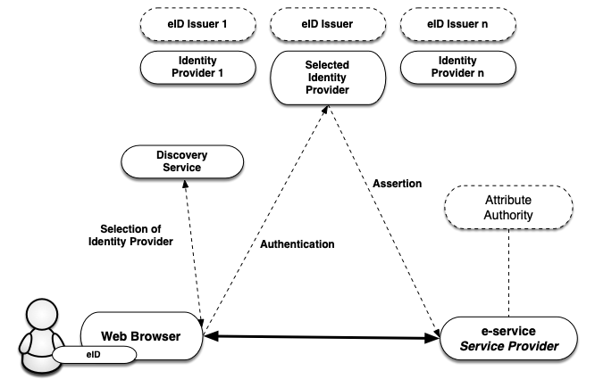

</img>
</img>

</img>

# Introduction to the Swedish eID Framework

### 2020-01-14

*2019-267*

---

## Table of Contents

1. [**Introduction**](#introduction)

    1.1. [Overview](#overview)

    1.2. [The Assurance Framework and Levels of Assurance](#the-assurance-framework-and-levels-of-assurance)

    1.3. [Service for Collection, Administration and Publishing of Metadata](#service-for-collection-administration-and-publishing-of-metadata)

    1.4. [Discovery Service](#discovery-service)

    1.5. [Relying Party Integration](#relying-party-integration)

    1.6. [Signatures](#signatures)

    1.7. [The Technical Framework and eIDAS](#the-technical-framework-and-eidas)

    1.7.1. [Foreign eID Authentication](#foreign-eid-authentication)
    
    1.7.2. [Signing using a Foreign eID](#signing-using-a-foreign-eid)

    1.7.3. [Handling of Identities](#handling-of-identities)
    
    1.7.4. [Swedish eID:s in Foreign Services](#swedish-eids-in-foreign-services)

2. [**Technical Specifications**](#technical-specifications)

    2.1. [SAML Profiles](#saml-profiles)
    
    2.1.1. [Deployment Profile for the Swedish eID Framework](#deployment-profile-for-the-swedish-eid-framework)

    2.1.2. [Swedish eID Framework - Registry for identifiers](#swedish-eid-framework-registry-for-identifiers)
    
    2.1.3. [Attribute Specification for the Swedish eID Framework](#attribute-specification-for-the-swedish-eid-framework)
    
    2.1.4. [Entity Categories for the Swedish eID Framework](#entity-categories-for-the-swedish-eid-framework)

    2.1.5. [eIDAS Constructed Attributes Specification for the Swedish eID Framework](#eidas-constructed-attributes-specification-for-the-swedish-eid-framework)
    
    2.1.6. [Implementation Profile for BankID Identity Providers within the Swedish eID Framework](#bankid-profile)
    
    2.1.7. [Principal Selection in SAML Authentication Requests](#principal-selection-in-saml-authentication-requests)

    2.2. [Signature Specifications](#signature-specifications)
    
    2.2.1. [Implementation Profile for using OASIS DSS in Central Signing Services](#implementation-profile-oasis-dss)
    
    2.2.2. [DSS Extension for Federated Central Signing Services](#dss-extensions)
    
    2.2.3. [Certificate Profile for Certificates Issued by Central Signing Services
](#certificate-profile-css)
    
    2.2.4. [Signature Activation Protocol for Federated Signing](#signature-activation)

3. [**References**](#references)

    3.1. [DIGG](#digg)

    3.2. [Other References](#other-references)

## 1. Introduction

### 1.1. Overview

The Swedish eID Framework (Sweden Connect Technical Framework) is adapted for identity federations based on SAML 2.0.

Relying parties receive identity assertions in a standardized format
from an identity provider.

Service providers that require electronic signatures do not need to be adapted to different
signature techniques based on different types of eID:s. Instead, a service provider makes 
use of a signature service where users with the support of authenticating at an identity 
provider are given the possibility to sign digital documents.

Within the federation, e-services and relying parties are taking the roles of 
Service Providers (SP), and authenticating services issuing identity assertions assume 
the roles of Identity Providers (IdP).

In cases where the service provider needs more information about the user, for example its
legal authority, an attribute service (*Attribute Authority*) within the federation can be queried, if such a service exists. Through an attribute 
request a service provider can obtain the necessary supplementary information in order to
authorize the user and provide access to its service.

As both personal identity information and other attributes linked to
users are provided through identity assertions, all types of eID:s that have 
an identity provider within the federation can be used by a service provider
that requires specific identity attributes, even if a particular eID does not
hold this information.

Figure 1: *Illustration of the communication between the different services within an identity federation.*

### 1.2. The Assurance Framework and Levels of Assurance

The basis for the level of security applied when a user authenticates is the 
*level of assurance* for the eID required by the service provider. In order for
these levels to be comparable within the federation, four assurance levels are defined (1 to
 4) in the Swedish eID Assurance Framework \[[EidTillit](#eidtillit)\] and three
assurance levels (low, substantial, high) are defined by the EU regulation eIDAS. 
Any service issuing identity assertions must prove that the process of issuing
identity assertions meets the requirements of a given level. This includes:

-   Requirements for the creation of an identity assertion.

-   Requirements for electronic authentication.

-   Requirements for the issuing process.

-   Requirements for the actual eID and its use.

-   Requirements on the issuer of the eID.

-   Requirements for establishing the identity of the eID applicant.

### 1.3. Service for Collection, Administration and Publishing of Metadata

A SAML federation provides information about the federation
participants through SAML metadata. Participants of a federation comprises of
services providing identity and attributes assertions and relying parties, i.e., 
service providers that consume these services.

Through the federation's metadata, participants obtain information about others
participants' services, including the information required for a safe
exchange of information between services. Metadata needs to be updated
by each party and conform to agreed conditions.

The main purpose of metadata is to provide the keys/certificates
required for secure communication and information exchange between services.
In addition to keys, metadata also contain other important information
for collaboration between services, for example, addresses of required functions,
information on assurance levels, service categories, user interface information, etc.

An identity federation is defined by a register in XML format that is
signed with the federation operator certificate. The file contains
information on identity federation members including their
certificates. Because the metadata file is signed, it is sufficient to
compare a certificate with its equivalent in metadata. An
infrastructure based on a central federation register requires
that the register is constantly updated and that the members of the federation
always use the latest version of the file.

### 1.4. Discovery Service

Within an identity federation, it is possible to offer and consume a common
Discovery Service, that lists which identity providers (or eID:s) that are 
available for a user to choose from to authenticate. The purpose of such a
service is to relieve the individual service providers that are part of the 
identity federation from implementing support for how users choose how to
authenticate.

By making the discovery service available within the identity federation,
service providers may direct its users there for the choice of how to authenticate.
The discovery service interacts with the user who makes the choice and is
directed back to the service provider, along with the selected authentication choice. 
The service provider now knows to which identity provider the user should be directed
to for authentication.

> Currently, there is no common discovery service available within the Sweden Connect federation.

### 1.5. Relying Party Integration

Relying parties, e.g., service providers, integrate towards identity providers using
standardized messages and consume identity assertions that also have a standardized
format.

The Swedish eID Framework is influenced by the interoperability profile
”SAML V2.0 Deployment Profile for Federation Interoperability”
\[[SAML2Int](#saml2int)\]. This profile is supported by several commercial
products and vendors as well as open source libraries. This facilitates
the integration at the relying party side.

Most relying parties use stand-alone authentication servers which means that
the integration adaptation for supporting the Swedish eID Framework usually
is limited to the authentication solution used.

### 1.6. Signatures

The Swedish eID Framework enables digital signatures using any type of eID, even
those not based on certificates, as long as there is an identity provider for 
the particular eID. The reason for this is that the identity assertion that is
used during authentication for signature is standardized.

A Signature Service has as its purpose to offer digital signature services
within identity federations that follows the Swedish eID Framework.

By procuring1 and introducing a signature service, a relying party within the 
federation can offer users to sign electronic documents with the support
of the signature service. The user signature, and associated signature certificate,
is created by the signature service after the user has accepted to sign the
document by authenticating for the signature service2.

> \[1\]: It is also possible for a relying party to implement a signature service based on the specifications.

> \[2\]: It is important to point out that it is of the utmost importance that the user 
experiences that he or she is signing a document. Therefore, a signature flow should be 
used for the eID types that support this during "authentication for signature".

### 1.7. The Technical Framework and eIDAS

The EU regulation ([910/2014](https://ec.europa.eu/futurium/en/system/files/ged/eidas_regulation.pdf))
on electronic identification and trust services, eIDAS, places demands on Swedish 
public bodies to recognize the eID:s that other eIDAS countries have notified. 
This means that a public Swedish e-service based on certain rules must be able
to accept a login that is performed with an eID issued in another country.

#### 1.7.1. Foreign eID Authentication

The eIDAS technical specifications is built, as for the Swedish eID
Framework, upon SAML standards and profiles, and even though the
similarities are many, there are also differences between the specifications.
However, a Swedish service provider does not have top directly relate to
the eIDAS specifications. The figure below illustrates how the Swedish
eIDAS node (*eIDAS connector*) acts as a proxy between other countries
and the Swedish federation when a person is authenticated using a foreign
eID at a Swedish service provider.

The flow is as follows:

1.  A user with a foreign eID requests access to a Swedish service provider (i.e., wants to log in).
    
2.  The service provider lets the user select the login method using a
    discovery service. In this case the user chooses the "Foreign eID" option.

3.  The service provider creates an authentication request according to
    the Swedish eID Framework and directs the user to the Swedish eIDAS
    node (*connector*). The eIDAS node acts as an identity provider within
    the federation, which implies that the interaction with this service is
    performed in the same way as for other identity providers that comply
    with the Swedish eID Framework.
    
4.  The received request is processes and the eIDAS node displays a page
    where the user chooses his or hers country1. The Swedish
    eIDAS node now transforms the received authentication request into an
    authentication request according to the eIDAS format, and directs the
    user to the selected country's *eIDAS Proxy Service*.

5.  When the authentication request is processed by the eIDAS proxy service
    of the selected country, this country's technique for authentication will
    be used. Not all countries within eIDAS use SAML for authentication, but
    if that was the case in our example, the user would be directed to a
    national identity provider, and before that, maybe also a discovery service
    where the eID to use would be selected.

6.  When the user has authenticated an identity assertion, according to the
    eIDAS specifications, is created. This assertion contains eIDAS specific
    attribute that identify the user.

7.  This assertion is now posted back to the Swedish eIDAS node. The node receives
    the assertion and validates its validity. In conjunction with that the assertion
    is transformed from eIDAS format to a assertion according to Swedish standards
    the node will also invoke an *Attribute Authority*, to, if possible, obtain
    a Swedish personal identity number based on the attributes received2.

8.  Finally, an assertion, formatted according to the Swedish eID Framework, is posted
    back to the service provider.

9.  The service provider may now complement the data with additional information
    in order to decide whether the user should be granted access to the service.

Thus, Swedish services only have to implement support according to the Swedish eID
Framework also when authenticating foreign users. However, in order for the service
to fully accept the authenticated user it must also be able to handle the identity 
presented, and this is most likely not a  Swedish personal identity number. See further
section 1.7.3 below.

> \[1\]: The correct way to describe this would be to ask the user to which eIDAS Proxy
Service to send the request to. This is dependent on the nationality of the user's
eID issuer.

> \[2\]: At the time of writing (September 2019) there is no attribute authority available
providing Swedish personal identity numbers based on eIDAS attributes.

#### 1.7.2. Signing using a Foreign eID

As already described, a model for digital signatures named "federated signatures"
is used within the context of the Swedish eID Framework. A server based signature
service is associated with the e-service that is the requestor of signatures.
When a user signs a document the e-service directs the user along with a signature 
request to the signature service. The signature service now requests that the
user authenticate (at an identity provider). In conjunction with the authentication
the user approves the signature. The signature service then sends the user back to
the e-service along with the signature data, and the e-service stores the signature
as a signed document.

This procedure makes it possible for Swedish e-services to offer signing för users
having foreign eID:s, since a signature service can choose to authenticate the user
having a foreign eID in accordance with the process described in section 1.7.1 above.

In this case, the Swedish eIDAS node is responsible of informing the user that
the purpose of the authentication is to approve the signature of a document,
and displays information about the requestor of the signature and information
about what is being signed. When the user has authenticated an identity assertion
is issued and sent back to the signature service who now generates the signature.

#### 1.7.3. Handling of Identities

Identity assertions from other countries follow common technical
specifications within the framework of the eIDAS regulations. These
specifications define a *Minimum Dataset* (MDS) which is the a set of
attributes that every country must supply for authenticated users and 
legal entities. Each country must provide an unique identifier per eID
that represents a natural person. For some countries, these identifiers
will be unique and persistent per person in the same way as a Swedish
personal identity number is, but identifiers may have different compositions
and properties. A property that may vary is the persistence of an
person identifier, i.e., whether such an identifier is unchanged during
a person's lifetime, or whether it is changed because the user moves to
another region, changes name, or simply obtains a new eID. For some
countries (for example, Great Britain) the identifier will be different
depending on which of the country's eID:s that user is currently using.

In order to simplify the handling of users and identities in Swedish services
the Swedish eIDAS node generates a standardized identity attribute for
users that have been authenticated using a foreign eID, a so called 
*Provisional ID* (PRID). The eIDAS node will also create an attribute
that declares which persistence, or lifetime, the PRID attribute has.
The PRID attribute is generated based on attributes values received from
the foreign authentication according to specific methods for each country.
Every combination of country and method a graded based on expected persistence,
i.e., how likely it is that an identity for a person is changed over time.
This makes it possible for Swedish services to customize the communication
with the user and to proactively provide features for a user whose identity
has changed, and make it possible for this user to access his or hers account.

In some cases, a person that has been authenticated using a foreign eID may
hold a Swedish personal identity number. It can, for example, be a Swedish
citizen that has moved abroad and obtained a foreign eID, or a foreign
citizen that is, or has been, registered (folkbokförd) in Sweden and has been
assigned a Swedish personal identity number.

The fact that a person holding a foreign eID possesses a Swedish personal identity
number is normally not known to the foreign identity provider, and this information
will not be part of the identity assertion from the foreign country. However, the
Swedish eIDAS node has the possibility to query an attribute authority in Sweden1
whether there exists a registered Swedish personal identity number for the person
being authenticated, and may, if this is the case, add this information to the identity
assertion that is sent back to the Swedish service provider.

> \[1\]: At the time of writing (September 2019) there is no attribute authority available
providing Swedish personal identity numbers based on eIDAS attributes.

#### 1.7.4. Swedish eID:s in Foreign Services

The eIDAS regulations states that Sweden has the possibility to notify Swedish eID:s 
according to the assurance levels low, substantial and high. There is a political will
in Sweden to allow holders of Swedish eID:s log in to foreign e-services1.

A request for authentication from a foreign service provider is sent to the Swedish 
eIDAS node (*eIDAS proxy service*) via an eIDAS connector in the service provider country. 
At the Swedish eIDAS node, the user chooses which Swedish eID he or she wants to use 
to authenticate, and an authentication request is sent to the identity provider that
offers authentication for the selected eID. This request is according to the Swedish
eID Framework which means that a Swedish identity provider does not have to conform to
the eIDAS technical specifications.

The user is authenticated by the Swedish identity provider and an identity assertion
is issued (according to the Swedish eID Framework). This assertion is received by the
Swedish eIDAS node (proxy service), and transformed to an assertion according to the
eIDAS specifications before being sent to the foreign eIDAS connector, and then to the
initiating foreign service provider.
 
> \[1\]: The project for notifying Swedish eID for use within the eIDAS cooperation began 
in September 2019.

## 2. Technical Specifications

This chapter contains specifications and profiles for identity federations and 
related services that conforms to the Swedish eID Framework (Sweden Connect 
Technical Framework). These documents are normative for the delivery of services 
within identity federations that implement the Swedish eID Framework, unless 
otherwise stated.

### 2.1. SAML Profiles

Identity federations conforming to the Swedish eID Framework are built around
”Deployment Profile for the Swedish eID Framework”, [\[EidProfile](#eidprofile)\].
This profile is influenced by, but not normatively dependent on, ”SAML V2.0 Deployment Profile for Federation Interoperability” \[[SAML2Int](#saml2int)\]. [\[EidProfile](#eidprofile)\] also contains rules and guidelines specific for the Swedish eID Framework.

#### 2.1.1. Deployment Profile for the Swedish eID Framework

The ”Deployment Profile for the Swedish eID Framework” specification, [\[EidProfile](#eidprofile)\], 
is the main specification of the eID Framework and comprises of:

- How SAML metadata is constructed and interpreted.

- How the format of an authentication request should be compiled.

- How an authentication request should be processed, and how an identity assertion should be constructed, verified and processed.

- Security requirements.

- Specific SAML requirements for signature services and "authentication for signature".

#### 2.1.2. Swedish eID Framework - Registry for identifiers

The implementation of an infrastructure for Swedish eID:s demand different forms
of identifiers to represent objects in data structures. The document
”Swedish eID Framework - Registry for identifiers”, \[[EidRegistry](#eidregistry)\],
defines the structure for identifiers that are assigned within the scope of
the Swedish eID Framework, and contains a registry of defined identifiers.

#### 2.1.3. Attribute Specification for the Swedish eID Framework

The specification ”Attribute Specification for the Swedish eID Framework”,
\[[EidAttributes](#eidattributes)\], declares the SAML attribute profiles
that are used within identity federations that follow the Swedish eID
Framework, including services that connect to eIDAS using the Swedish eID
node.

#### 2.1.4. Entity Categories for the Swedish eID Framework

Entity Categories are used within the federation for different purposes:

-   Service Entity Categories – Are used in metadata to represent service
    provider requirements regarding assurance levels and attributes,
    and identity provider declarations for supported assurance levels
    and attribute release capabilities.

-   Service Property Categories – Are used to represent certain properties
    of services within the federation.

-   Service Type Entity Categories – Represents different service types
    within the federation.
    
-   Service Contract Entity Categories - Are used by services to declare
    legal and business agreements.
    
-   General Entity Categories - Entity categories that do not fall within
    the scope of any of the other types.

The specification ”Entity Categories for the Swedish eID Framework”
\[[EidEntCat](#eidentcat)\] specifies the entity categories that are defined in
the Swedish eID Framework and describes their meaning.

#### 2.1.5. eIDAS Constructed Attributes Specification for the Swedish eID Framework

The specification ”eIDAS Constructed Attributes Specification for the Swedish
eID Framework”, \[[EidConstrAttributes](#eidconstrattributes)\], defines processes and
rules for how an identity attribute are constructed based on the attributes that are
received during an eIDAS authentication.

#### 2.1.6. Implementation Profile for BankID Identity Providers within the Swedish eID Framework

The specification "Implementation Profile for BankID Identity Providers within the Swedish eID Framework", \[[EidBankID](#eidbankid)\], defines rules for identity providers that implement
support for the Swedish BankID eID.

> **Note:** This specification is not normative for conformance to the Swedish eID Framework.
It is only relevant for identity providers implementing support for BankID and for service
providers using those identity providers. However, an identity provider that implements BankID and wants to join the Sweden Connect federation must follow this specification.

#### 2.1.7. Principal Selection in SAML Authentication Requests

The specification "Principal Selection in SAML Authentication Requests", \[[EidPrincipalSel](#eidprincipalsel)\], defines an extension to SAML making it possible for a relying party
to inform an identity provider about the identity of the user that it wishes to be authenticated.

### 2.2. Signature Specifications

This section contains references to the documents that define signature services
within federations conformant to the Swedish eID Framework.

#### 2.2.1. Implementation Profile for using OASIS DSS in Central Signing Services

The implementation profile ”Implementation Profile for Using OASIS DSS in
Central Signing Services”, \[[EidDSSProfile](#eiddssprofile)\], specifies a profile
for signature requests and responses according to the OASIS standard
”Digital Signature Service Core Protocols, Elements, and Bindings”,
\[[DSS](#dss)\].

#### 2.2.2. DSS Extension for Federated Central Signing Services

”DSS Extension for Federated Central Signing Services”, \[[EidDSSExt](#eiddssext)\], is an
extension to the OASIS standard ”Digital Signature Service Core Protocols, Elements, and Bindings”, \[[DSS](#dss)\], where definitions required for signatures according to the Swedish 
eID Framework are specified.

#### 2.2.3. Certificate Profile for Certificates Issued by Central Signing Services

The certificate profile ”Certificate profile for certificates issued by Central Signing services”, \[[EidCertProf](#eidcertprof)\], specifies the contents of a signature certificate. This profile
defines a certificate extension for use by signature services.

This profile refers to "Authentication Context Certificate Extension", \[[AuthContext](#authcontext)\], 
that describes how an ”Authentication Context” is represented in X.509 certificates.

#### 2.2.4. Signature Activation Protocol for Federated Signing

The specification "Signature Activation Protocol for Federated Signing", \[[EidSigAct](#eidsigact)\], 
defines a "Signature Activation Protocol" (SAP) for implementation of "Sole Control Assurance Level 2" (SCAL2) according to the standard "prEN 419241 - Trustworthy Systems Supporting Server Signing".

## 3. References

### 3.1. DIGG

**\[EidTillit\]**
> [Tillitsramverk för Svensk e-legitimation - 2018-158](https://docs.swedenconnect.se/technical-framework/mirror/digg/Tillitsramverk-for-Svensk-e-legitimation-2018-158.pdf)

**\[EidProfile\]**
> [Deployment Profile for the Swedish eID Framework](https://docs.swedenconnect.se/technical-framework/updates/ELN-0602_-_Deployment_Profile_for_the_Swedish_eID_Framework.html).

**\[EidRegistry\]**
> [Swedish eID Framework - Registry for identifiers](https://docs.swedenconnect.se/technical-framework/updates/ELN-0603_-_Registry_for_Identifiers.html).

**\[EidAttributes\]**
> [Attribute Specification for the Swedish eID Framework](https://docs.swedenconnect.se/technical-framework/updates/ELN-0604_-_Attribute_Specification_for_the_Swedish_eID_Framework.html).

**\[EidEntCat\]**
> [Entity Categories for the Swedish eID Framework](https://docs.swedenconnect.se/technical-framework/updates/ELN-0606_-_Entity_Categories_for_the_Swedish_eID_Framework.html).

**\[EidConstrAttributes\]**
> [eIDAS Constructed Attributes Specification for the Swedish eID
> Framework](https://docs.swedenconnect.se/technical-framework/updates/ELN-0611_-_eIDAS_Constructed_Attributes_Specification_for_the_Swedish_eID_Framework.html).

**\[EidBankID\]**
> [Implementation Profile for BankID Identity Providers within the Swedish eID Framework](https://docs.swedenconnect.se/technical-framework/updates/ELN-0612_-_BankID_Profile_for_the_Swedish_eID_Framework.html).

**\[EidPrincipalSel\]**
> [Principal Selection in SAML Authentication Requests](https://docs.swedenconnect.se/technical-framework/updates/ELN-0614_-_Principal_Selection_in_SAML_Authentication_Requests.html).

**\[EidDSSProfile\]**
> [Implementation Profile for Using OASIS DSS in Central Signing
> Services](https://docs.swedenconnect.se/technical-framework/latest/ELN-0607_-_Implementation_Profile_for_using_DSS_in_Central_Signing_Services.html).

**\[EidDSSExt\]**
> [DSS Extension for Federated Central Signing Services](https://docs.swedenconnect.se/technical-framework/latest/ELN-0609_-_DSS_Extension_for_Federated_Signing_Services.html).

**\[EidCertProf\]**
> [Certificate profile for certificates issued by Central Signing
> services](https://docs.swedenconnect.se/technical-framework/latest/ELN-0608_-_Certificate_Profile_for_Central_Signing_Services.html).

**\[EidSigAct\]**
> [Signature Activation Protocol for Federated Signing](https://docs.swedenconnect.se/technical-framework/updates/ELN-0613_-_Signature_Activation_Protocol.html).

### 3.2. Other references

**\[SAML2Int\]**
> [SAML V2.0 Deployment Profile for Federation Interoperability](https://kantarainitiative.github.io/SAMLprofiles/saml2int.html).

**\[DSS\]**
> [OASIS Standard – Digital Signature Service Core Protocols, Elements,
> and Bindings Version 1.0, April 11,
> 2007](http://docs.oasis-open.org/dss/v1.0/oasis-dss-core-spec-v1.0-os.doc).

**\[AuthContext\]**
> [RFC-7773: Authentication Context Certificate Extension](https://tools.ietf.org/html/rfc7773).

