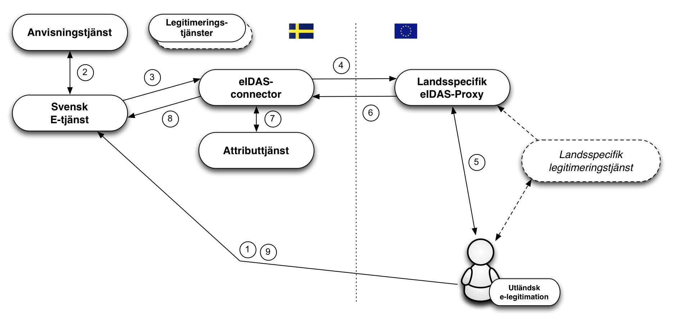

</img>

# E-legitimationsnämndens Tekniska ramverk

### Version: 1.5 - 2016-11-16
#### *Utkast*

*ELN-0600-v1.5*

---

## Innehållsförteckning

1. [**Introduktion**](#introduktion)

    1.1. [Översikt](#översikt)

    1.2. [Tillitsramverk och säkerhetsnivåer](#tillitsramverk-och-säkerhetsnivåer)

    1.3. [Tjänst för insamling, administration och publicering av metadata](#tjänst-för-insamling,-administration-och-publicering-av-metadata)

    1.4. [Anvisningstjänst](#anvisningstjänst)

    1.5. [Integration hos förlitande part](#integration-hos-förlitande-part)

    1.6. [Underskrift](#underskrift)

    1.7. [E-legitimationsnämndens tekniska ramverk och eIDAS](#e-legitimationsnämndens-tekniska-ramverk-och-eidas)

    1.7.1. [Autentiseringar med utländska e-legitimationer](#autentiseringar-med-utländska-e-legitimationer)

    1.7.2. [Underskrifter med utländska e-legitimationer](#underskrifter-med-utländska-e-legitimationer)

    1.7.3. [Hantering av identiteter](#hantering-av-identiteter)

    1.7.4. [När svenska e-legitimationer används i utländska e-tjänster](#när-svenska-e-legitimationer-används-i-utländska-e-tjänster)

2. [**Tekniska specifikationer**](#tekniska-specifikationer)

    2.1. [SAML-profiler](#saml-profiler)

    2.1.1. [Specifikationer för anvisning (Discovery)](#specifikationer-för-anvisning-(discovery))

    2.2. [Specifikationer för identitetsfederationer som följer E-legitimationsnämndens tekniska ramverk](#specifikationer-för-identitetsfederationer-som-följer-e-legitimationsnämndens-tekniska-ramverk)

    2.2.1. [Register för identifierare definierade av E-legitimationsnämnden](#register-för-identifierare-definierade-av-e-legitimationsnämnden)

    2.2.2. [Attributspecifikation](#attributspecifikation)

    2.2.3. [Specifikationer av entitetskategorier](#specifikationer-av-entitetskategorier)

    2.3. [Specifikationer för Underskriftstjänst](#specifikationer-för-underskriftstjänst)

3. [**Referenslista**](#referenslista)

    3.1. [E-legitimationsnämnden](#e-legitimationsnämnden)

    3.2. [Övriga referenser](#övriga-referenser)

4. [**Ändringar mellan versioner**](#ändringar-mellan-versioner)

## 1. Introduktion

### 1.1. Översikt

E-legitimationsnämndens tekniska ramverk är anpassat för
identitetsfederationer som baseras på SAML 2.0.

Förlitande parter erhåller identitetsintyg i ett standardiserat format
från en identitetsintygstjänst, i detta ramverk benämnd
legitimeringstjänst. Legitimeringstjänsterna tillhandahålls av, i
federationen, godkända leverantörer av intygstjänster.

Detta innebär också att e-tjänster som kräver underskrift inte längre
behöver anpassas efter olika användares e-legitimationer för att skapa
elektroniska underskrifter. Istället överlåter e-tjänsten detta till en
underskriftstjänst där användare med stöd av legitimering via
intygstjänsten ges möjlighet att underteckna elektroniska handlingar.

Inom federationen intar e-tjänster och motsvarande förlitande parter
rollen som Service Provider (SP) medan legitimeringstjänster som
utfärdar identitetsintyg intar rollen som Identity Provider (IdP) och
därmed den som autentiserar användaren, oavsett mot vilken e-tjänst som
användaren legitimerar sig.

För de fall där e-tjänsten behöver mer information om användaren t ex.
uppgift om juridisk behörighet, kan en fråga ställas till en
attributtjänst, Attribute Authority (AA), inom federationen, om sådan
relevant attributtjänst finns. Genom en attributsförfrågan kan
e-tjänsten erhålla nödvändig kompletterande information för att kunna
auktorisera användaren och ge tillgång till e-tjänsten eller
motsvarande.

Då såväl personidentitetsuppgifter som andra attribut kopplat till
användare tillhandahålls genom identitetsintyg och attributsintyg, kan
alla typer av e-legitimationer som förlitande part har avtal om och som
ingår i federationen användas för legitimering mot en e-tjänst som
kräver såväl personnummer/samordningsnummer som ytterligare information
om juridisk behörighet, även om e-legitimationen inte innehåller några
specifika personuppgifter (t.ex. koddosor för generering av
engångslösenord).

Figur 1: *Illustration av kommunikationen mellan de olika tjänsterna inom
en identitetsfederation.*

### 1.2. Tillitsramverk och säkerhetsnivåer

Grunden för vilken säkerhetsnivå som tillämpas när en användare
legitimerar sig är den tillitsnivå avseende e-legitimationen som
e-tjänsten kräver. För att dessa säkerhetsnivåer ska kunna vara
jämförbara inom ramen för federationen definieras fyra tillitsnivåer (1
– 4) i Tillitsramverket för Svensk e-legitimation \[EidTillit\] och tre
tillitsnivåer (låg, väsentlig, hög) i EU-förordningen eIDAS. Alla som
utfärdar identitetsintyg måste visa att hela den process som ligger till
grund för utfärdandet av identitetsintyg uppfyller kraven i den
efterfrågade tillitsnivån, detta innefattar bl.a.

-   Krav på skapandet av identitetsintyget.

-   Krav på den elektroniska legitimeringen (autentiseringen).

-   Krav på utfärdandeprocessen.

-   Krav på själva e-legitimationen och dess användning.

-   Krav på utfärdaren av e-legitimationen.

-   Krav på fastställande av den e-legitimationssökandens identitet.

### 1.3. Tjänst för insamling, administration och publicering av metadata

En SAML-federation tillhandahåller information om federationens
deltagare genom s.k. metadata. Som deltagare i en federation räknas
såväl aktörer som levererar legitimerings- och attributtjänster i
federationen som förlitande parter, d.v.s. aktörer som konsumerar dessa
tjänster, t ex. e-tjänster.

Genom federationens metadata kan deltagare inhämta information om andra
deltagares tjänster, inklusive de uppgifter som krävs för ett säkert
informationsutbyte mellan deltagarna. Metadata måste hållas uppdaterat
av respektive part och överensstämma med avtalade förhållanden.

Det viktigaste syftet med metadata är att tillhandahålla de nycklar som
krävs för säker kommunikation och informationsutväxling mellan tjänster.
Utöver nycklar innehåller metadata även annan information som är viktig
för samverkan mellan tjänster t ex. adresser till funktioner som krävs,
information om tillitsnivåer, tjänstekategorier,
användargränssnittsinformation mm.

Identitetsfederationer förutsätter att legitimeringstjänster och
e-tjänster litar på varandra och därmed kan verifiera de signaturer som
används i kommunikationen mellan parterna. Rent tekniskt baseras denna
tillit på att respektive aktörer litar på varandras
signeringscertifikat.

En identitetsfederation definieras av ett register i XML-format som är
signerat med federationsoperatörens certifikat. Filen innehåller
information om identitetsfederationens medlemmar inklusive deras
certifikat. Eftersom filen med metadata är signerad räcker det med att
jämföra ett certifikat med dess motsvarighet i metadata. En
infrastruktur baserad på ett centralt federationsregister förutsätter
att registret uppdateras kontinuerligt samt att federationsmedlemmarna
alltid använder den senaste versionen av filen.

### 1.4. Anvisningstjänst

I en identitetsfederation är det möjligt att erbjuda och konsumera en
gemensam anvisningstjänst (Discovery Service), som listar vilka
legitimeringstjänster som är möjliga för användaren att välja mellan.
Syftet med en sådan anvisningstjänst är att avlasta de enskilda
e-tjänsterna som ingår i identitetsfederationen från att själva
implementera stöd för hur användare väljer legitimeringstjänst (eller
inloggningsmetod).

Genom att anvisningstjänsten finns tillgänglig inom
identitetsfederationen kan e-tjänster styra sina användare dit för val
av legitimeringstjänst. Anvisningstjänsten interagerar med användaren
som gör sitt val och användaren, tillsammans med dennes val, styrs
tillbaka till e-tjänsten som nu vet till vilken legitimeringstjänst
användaren ska skickas för legitimering.

### 1.5. Integration hos förlitande part

Förlitandeparter, t.ex. e-tjänster, integrerar mot legitimeringstjänster
genom standardiserade meddelanden och konsumerar identitetsintyg vilka
också har standardiserade format.

Detta tekniska ramverk bygger på interoperabilitetsprofilen ” SAML2int
Profile – SAML 2.0 Interoperability Profile”
\[[SAML2Int](http://saml2int.org/profile/current/)\]. Profilen stöds av
ett flertal kommersiella produkter och Open Source-lösningar, vilket
underlättar integrationsarbetet hos e-tjänster.

Många e-tjänster använder fristående autentiseringslösningar vilket
innebär att en anpassning av integrationen för att följa
E-legitimationsnämndens tekniska ramverk får en begränsad påverkan på
e-tjänsten som sådan.

### 1.6. Underskrift

Vid underskrift blir det med E-legitimationsnämndens tekniska ramverk
möjligt att använda olika typer av e-legitimationer, även sådana som
inte är certifikatbaserade, utan att speciella anpassningar i e-tjänsten
behövs. Orsaken är att det är det elektroniskt utställda
identitetsintyget (som används för identifiering av användare vid
underskrift) har samma format oavsett vilken typ av e-legitimation som
användaren använder.

En underskriftstjänst har som syfte att möjliggöra underskrift inom
identitetsfederationer som följer E-legitimationsnämndens tekniska
ramverk med stöd av alla typer av e-legitimationer som erbjuder
tillräcklig grad av säkerhet.

Genom att upphandla och införa en underskriftstjänst kan en förlitande
part som ingår i en sådan federation låta en användare skriva under en
elektronisk handling med stöd av den upphandlande underskriftstjänsten.
Användarens elektroniska signatur och tillhörande signeringscertifikat
skapas av underskriftstjänsten efter det att användaren accepterat att
skriva under genom att legitimera sig mot underskriftstjänsten.

### 1.7. E-legitimationsnämndens tekniska ramverk och eIDAS

EU-förordningen ([910/2014](http://eur-lex.europa.eu/legal-content/SV/TXT/PDF/?uri=CELEX:32014R0910&from=EN)) om elektronisk identifiering och betrodda
tjänster, eIDAS, ställer krav på svenska offentliga organ att erkänna de
e-legitimationer som andra eIDAS-länder har anmält. Detta innebär att en
offentlig svensk e-tjänst baserat på vissa regler skall kunna acceptera
en inloggning som utförs med en e-legitimation utställd i ett annat
land.

#### 1.7.1. Autentiseringar med utländska e-legitimationer

De tekniska specifikationerna för eIDAS bygger, såsom
E-legitimationsnämndens tekniska ramverk, på SAML-standarder, och även
om likheterna är många finns även skillnader i dessa specifikationer. En
svensk e-tjänst ska dock inte förhålla sig direkt till eIDAS tekniska
specifikationer. Nedanstående bild illustrerar hur
E-legitimationsnämndens eIDAS-nod (eIDAS-connector) agerar som en brygga
mellan andra länder och en svensk federation då en person autentiseras
med en utländsk e-legitimation mot en svensk e-tjänst.
E-legitimationsnämndens eIDAS-nod kommer att följa detta tekniska
ramverk.

Flödet är enligt följande:

1.  En användare med en utländsk e-legitimation begär åtkomst till en
    svensk e-tjänst (d.v.s., loggar in).
    
2.  E-tjänsten låter användaren välja inloggningssätt med hjälp av en
    anvisningstjänst. Ett val ”Foreign eID” visas upp, vilket användaren
    i eIDAS-fallet väljer.

3.  E-tjänsten skapar en legitimeringsbegäran enligt detta tekniska
    ramverk och styr användaren till den svenska eIDAS-noden (connector)
    som E-legitimationsnämnden ansvarar för. eIDAS-noden uppträder som
    en legitimeringstjänst (Identity Provider) i federationen/-erna in
    mot svenska förlitande parter vilket innebär att kommunikation med
    denna tjänst utförs på samma sätt som mot övriga
    legitimeringstjänster inom federationer som följer
    E-legitimationsnämndens tekniska ramverk.

4.  Den mottagna begäran behandlas och eIDAS-noden visar upp en valsida
    där användaren väljer ”sitt land”1. Den svenska eIDAS-noden
    omvandlar nu den mottagna legitimeringsbegäran till en
    legitimeringsbegäran enligt eIDAS och användaren styrs till det
    valda landets ”eIDAS Proxy-tjänst”.

5.  Då legitimeringsbegäran mottas av den eIDAS-Proxy-tjänst för valt
    land tar detta lands teknik för autentisering över. Inte alla länder
    inom eIDAS använder SAML för autentisering, men om så var fallet i
    vårt exempel skulle användaren styras vidare till en
    legitimeringstjänst (Identity Provider), och innan dess kanske även
    en anvisningstjänst för val av legitimeringstjänst.

6.  Då en autentisering utförts skapas ett intyg (Assertion) enligt
    eIDAS specifikationer. Detta intyg innehåller bl.a. eIDAS-specifika
    attribut som identifierar användaren.

7.  Detta intyg styrs nu vidare till den svenska eIDAS-noden. Noden tar
    emot intyget och validerar dess korrekthet. I samband med att
    intyget transformeras från eIDAS-format till ett intyg utformat
    enligt E-legitimationsnämndens tekniska ramverk anropar noden också
    en attributtjänst för att, om möjligt, givet eIDAS-attribut erhålla
    attribut som stöds av den svenska e-tjänsten (t.ex. slå upp ett
    svenskt person- eller samordningsnummer givet ett eIDAS
    *PersonIdentifier*-attribut).

8.  Slutligen postas ett intyg, på ett format som uppfyller
    E-legitimationsnämndens tekniska ramverk, till e-tjänsten.

9.  Förlitande part kompletterar eventuellt med ytterligare information
    och avgör om användaren ska ges till åtkomst till tjänsten.

Svenska e-tjänster behöver således endast stödja E-legitimationsnämndens
tekniska ramverk för att kunna hantera en autentisering utförd med en
europeisk e-legitimation. Dock måste e-tjänsten kunna hantera den
identitet som presenteras, vilket inte nödvändigtvis är ett personnummer
eller samordningsnummer. Det kan alltså hända att en e-tjänst
autentiserar en användare via eIDAS-ramverket, men att användarens
presenterade identitet inte går att använda hos e-tjänsten. Mer om detta
i kapitlet 1.7.3 nedan.

> \[1\]: Egentligen väljer användaren till vilken ”eIDAS Proxy-tjänst” som begäran ska skickas vidare till. Detta är beroende landstillhörigheten för användarens e-legitimationsutfärdare.

#### 1.7.2. Underskrifter med utländska e-legitimationer

Inom ramen för detta tekniska ramverk tillämpas en modell för
elektronisk underskrift som kallas federerad underskrift. En
serverbaserad underskriftstjänst knyts till e-tjänsten som i sin tur
begär underskrift. När en användare skriver under ett dokument skickar
e-tjänsten en underskriftsbegäran till underskriftstjänsten.
Underskriftstjänsten begär därefter att användaren legitimerar sig. I
samband med legitimeringen godkänner användaren underskriften.
Underskriftstjänsten skickar tillbaka uppgifter till e-tjänsten och
därefter lagras underskriftsuppgifterna kopplade till den handling som
har skrivits under.

Detta förfarande möjliggör att skriva under även med utländsk
e-legitimation då underskriftstjänsten kan välja att legitimera
användaren med utländsk e-legitimation i enlighet med förfarandet som
beskrivs ovan i avsnitt 1.7.1.

Vid en underskrift ansvarar i det fallet den svenska eIDAS-noden för att
användaren upplyses om att syftet med legitimeringen är att skriva under
ett dokument, vem som begärt underskrift samt med eventuell information
om vad som undertecknas. Först när användaren genom att legitimera sig
(för underskrift) utfärdas ett identitetsintyg, som skickas till
underskriftstjänsten och som i sin tur genererar underskriften.

I likhet med underskrift med stöd av legitimering med svenska
e-legitimationer så innebär underskrift med utländsk e-legitimation att
användarens av förlitande part registrerade identitet kan utgöras av
andra attribut än de som tillhandahålls av legitimeringstjänsten (t.ex.
anställningsnummer i stället för personnummer).

#### 1.7.3. Hantering av identiteter

Identitetsintyg från andra länder följer EU-gemensamma tekniska
specifikationer framtagna inom ramen för eIDAS-regelverket. Här
specificeras de attribut som varje land alltid måste skicka med för
fysiska personer såväl som för organisationer (”Minimum Dataset”, MDS).
Varje land måste skicka med en unik identifierare per e-legitimation som
representerar endast en fysisk person. Från vissa länder kommer dessa
identifierare vara unika och beständiga per person på motsvarande sätt
som t.ex. svenska personnummer, men dessa identifierare kan ha vitt
skilda sammansättningar och ha väldigt olika egenskaper. En egenskap som
kan variera är hur persistent en sådan identifierare är, d.v.s., om en
sådan identifierare är oförändrad under en persons livstid eller om den
ändras om personen exempelvis flyttar till en annan region, byter namn
eller bara byter e-legitimation. Från några länder (t.ex.
Storbritannien) kommer identifieraren att vara olika beroende på vilken
av landets e-legitimationer en användare för tillfället väljer att
använda.

För att förenkla hanteringen av användare i svenska e-tjänster så
genererar den svenska eIDAS-noden ett standardiserat ID-attribut för
användare som legitimerats med utländsk e-legitimation, ett s.k.
*provisional ID* (förkortat PRID). Dessutom skapas ett tillhörande
attribut som deklarerar vilken förväntad persistens, eller livslängd,
detta ID-attribut har. PRID-attributet genereras utifrån de
attributvärden som erhålls från den utländska legitimeringen enligt
specificerade metoder för respektive land. Varje kombination av land och
metod klassas med avseende på förväntad persistens, d.v.s., hur
sannolikt det är att en identitet ändras över tiden för samma person.
Detta gör det möjligt för svenska e-tjänster att anpassa kommunikationen
med användaren och proaktivt tillhandahålla funktioner som underlättar
för en användare vars identitet har ändrats, att återfå kontrollen över
sin information i e-tjänsten.

I vissa fall kan en person som legitimeras med en utländsk
e-legitimation även inneha ett svenskt personnummer eller ett styrkt
svenskt samordningsnummer. Det kan till exempel röra sig om en svensk
medborgare som flyttat utomlands och skaffat utländsk e-legitimation
eller en utländsk medborgare som har sådan anknytning till svenska
myndigheter att denne tilldelats ett styrkt samordningsnummer.

Det faktum att en person med utländsk e-legitimation innehar ett svenskt
personnummer eller samordningsnummer är normalt sett inte känt för den
utländska legitimeringstjänsten och denna information ingår därför inte
i identitetsintyg från landet där personen legitimeras. Den svenska
noden har däremot möjlighet att fråga en attributtjänst i Sverige2 om
det finns ett registrerat personnummer eller samordningsnummer för den
legitimerade personen och kan, om så är fallet, påföra sådan information
i det identitetsintyg som skickas till e-tjänsten.

> \[2\]: Om en sådan kommer att finnas i enlighet med Skatteverkets förslag till regeringen i oktober 2016.

#### 1.7.4. När svenska e-legitimationer används i utländska e-tjänster

*Kommer att kompletteras* *senare.*

## 2. Tekniska specifikationer

Detta kapitel innehåller specifikationer och profiler för
identitetsfederationer som följer E-legitimationsnämndens tekniska
ramverk, och vissa kringliggande tjänster. Där inget annat nämns är
dessa dokument normativa för leverans av tjänster inom
identitetsfederationer som implementerar E-legitimationsnämndens
tekniska ramverk.

### 2.1. SAML-profiler

Identitetsfederationer som följer detta tekniska ramverk är uppbyggda
kring följande SAML-profiler:

-   Implementationsprofil – ”Kantara Initiative eGovernment
    Implementation Profile of SAML 2.0”
    \[[eGov2](http://kantarainitiative.org/confluence/download/attachments/42140355/kantara-report-egov-saml2-profile-2.0.pdf)\].

-   Deploymentprofil – E-legitimationsnämndens ”Deployment Profile for
    the Swedish eID Framework” \[EidProfile\]. Denna profil utgår från
    ”SAML2int profile – SAML 2.0 Interoperability Profile”
    \[[SAML2Int](http://saml2int.org/profile/current/)\].

#### 2.1.1. Specifikationer för anvisning (Discovery)

Den specifikation, \[EidDiscovery\], som gällt i tidigare versioner av
tekniskt ramverk är inte längre korrekt på grund av förändrade
förutsättningar. Specifikt beror detta på att den tidigare definitionen
att en e-legitimationsutfärdare endast kunde representeras med en
legitimeringstjänst inte längre gäller.

E-legitimationsnämnden planerar att utkomma med en uppdaterad
specifikation rörande anvisning i kommande utkast av tekniskt ramverk.

### 2.2. Specifikationer för identitetsfederationer som följer E-legitimationsnämndens tekniska ramverk

#### 2.2.1. Register för identifierare definierade av E-legitimationsnämnden

Implementering av en infrastruktur för Svensk e-legitimation kräver
olika former av identifierare för att representera objekt i
datastrukturer. Dokumentet ”Registry for identifiers assigned by the
Swedish e-identification board” \[EidRegistry\] definierar strukturen
för identifierare som tilldelats av E-legitimationsnämnden, samt ett
register över definierade identifierare.

#### 2.2.2. Attributspecifikation

Dokumentet ”Attribute Specification for the Swedish eID Framework”
\[EidAttributes\] deklarerar de SAML attributprofiler som används inom
identitetsfederationer som följer tekniskt ramverk inklusive de som
ansluter till eIDAS via den svenska eIDAS-noden.

Dokumentet ”eIDAS Constructed Attributes Specification for the Swedish
eID Framework” \[EidConstrAttributes\] specificerar processer och regler
för hur ID-attribut konstrueras baserat på attribut som tas emot vid
legitimering mot eIDAS.

#### 2.2.3. Specifikationer av entitetskategorier

Entitetskategorier (Entity Categories) används inom federationen för tre
syften:

-   Service Entity Categories – Används i federationens metadata för att
    representera e-tjänsters krav på tillitsnivåer och begärda attribut,
    samt legitimeringstjänsters uppfyllande av tillitsnivåer och
    leverans av attribut.

-   Service Property Categories – Används för att representera en viss
    egenskap hos en tjänst.

-   Service Type Entity Categories – Används för att representera olika
    tjänstetyper inom federationen.

Dokumentet ”Entity Categories for the Swedish eID Framework”
\[EidEntCat\] specificerar de entitetskategorier som definieras av
E-legitimationsnämnden och beskriver dess betydelse.

### 2.3. Specifikationer för Underskriftstjänst

Detta stycke innehåller referenser till de dokument vilka definierar
underskriftstjänster inom federationer som följer detta tekniska
ramverk.

Implementationsprofilen ”Implementation Profile for Using OASIS DSS in
Central Signing Services” \[EidDSSProfile\] specificerar en profil för
underskriftsbegäran och respons enligt OASIS standarden ”Digital
Signature Service Core Protocols, Elements, and Bindings”
\[[DSS](http://docs.oasis-open.org/dss/v1.0/oasis-dss-core-spec-v1.0-os.doc)\],
och utökar denna med definitioner specificerade i ”DSS Extension for
Federated Central Signing Services” \[EidDSSExt\].

Vidare definieras en certifikatprofil ”Certificate profile for
certificates issued by Central Signing services” \[EidCertProf\] som
specificerar innehåll i signeringscertifikat. Denna profil tillämpar en
ny certifikatextension till stöd för signeringstjänsten, Authentication
Context Certificate Extension \[AuthContext\], vilken beskriver hur
”Authentication Context” representeras i X.509 certifikat.

## 3. Referenslista

### 3.1. E-legitimationsnämnden

**\[EidTillit\]**
> Tillitsramverk för Svensk E-legitimation.

**\[EidProfile\]**
> Deployment Profile for the Swedish eID Framework.

**\[EidRegistry\]**
> Registry for identifiers assigned by the Swedish e-identification
> board.

**\[EidAttributes\]**
> Attribute Specification for the Swedish eID Framework.

**\[EidConstrAttributes\]**
> eIDAS Constructed Attributes Specification for the Swedish eID
> Framework.

**\[EidEntCat\]**
> Entity Categories for the Swedish eID Framework.

**\[EidDiscovery\]**
> Discovery within the Swedish eID Framework. (Ej längre giltigt).

**\[EidDSSProfile\]**
> Implementation Profile for Using OASIS DSS in Central Signing
> Services.

**\[EidDSSExt\]**
> DSS Extension for Federated Central Signing Services.

**\[EidCertProf\]**
> Certificate profile for certificates issued by Central Signing
> services.

### 3.2. Övriga referenser

**\[eGov2\]**
> [Kantara Initiative eGovernment Implementation Profile of SAML 2.0,
> Version 2.0, June 11,
> 2010.](http://kantarainitiative.org/confluence/download/attachments/42140355/kantara-report-egov-saml2-profile-2.0.pdf)

**\[SAML2Int\]**
> [SAML2int profile v0.2.1 – SAML 2.0 Interoperability
> Profile](http://saml2int.org/profile/current/).

**\[IdpDisco\]**
> [OASIS Committee Specification, Identity Provider Discovery Service
> Protocol and Profile, March
> 2008.](http://docs.oasis-open.org/security/saml/Post2.0/sstc-saml-idp-discovery.pdf)

**\[DSS\]**
> [OASIS Standard – Digital Signature Service Core Protocols, Elements,
> and Bindings Version 1.0, April 11,
> 2007](http://docs.oasis-open.org/dss/v1.0/oasis-dss-core-spec-v1.0-os.doc).

**\[AuthContext\]**
> [RFC-7773: Authentication Context Certificate Extension](https://tools.ietf.org/html/rfc7773).

## 4. Ändringar mellan versioner

**Ändringar mellan version 1.4 och version 1.5:**

-   Tillägg av avsnitt 1.7, om eIDAS.

-   Benämningen ”Tekniskt ramverk för Svensk e-legitimation” ersattes
    med ”E-legitimationsnämndens tekniska ramverk” med avsikten att
    reservera begreppet Svensk e-legitimation för kvalitetsmärkningen av
    svenska e-legitimationer vilken är oberoende av detta tekniska
    ramverk.

-   Referenser till tekniska specifikationer rörande anvisning i avsnitt
    2.1.1 togs bort på grund av ändrade förutsättningar.

**Ändringar mellan version 1.3 och version 1.4:**

-   Tekniskt ramverk för Svensk e-legitimation bygger nu på en nyare
    version av ”SAML2int Deployment Profile” (se
    <http://saml2int.org/profile/current/>).

-   Specifikationen ”Authentication Context Classes for Levels of
    Assurance for the Swedish eID Framework” är inte längre del av
    tekniskt ramverk för Svensk e-legitimation. Dess tidigare syfte har
    ersatts med användande av attribut (som definieras i
    \[EidAttributes\] och \[EidProfile\]). I detta dokument utgår det
    tidigare kapitlet 2.2.3, ”Identifierare och schema för
    representation av tillitsnivåer”.

-   Specifikationen \[EidDSSExt\] vars tidigare namn var ”Eid2 DSS
    Extension for SAML based Central Signing service” heter nu ”DSS
    Extension for Federated Central Signing Services”.

**Ändringar mellan version 1.2 och version 1.3:**

-   Tagit bort avsnittet *Integrering med verksamhetsspecifika
    federationer* (flyttas till vägledningar).

**Ändringar mellan version 1.1 och version 1.2:**

-   Genomgång av referenslistan. I övrigt inga förändringar.

**Ändringar mellan version 1.0 och version 1.1:**

-   Förtydliganden kring användande av entitetskategorier.

-   Tillägg av specifikationer för Underskriftstjänst.
