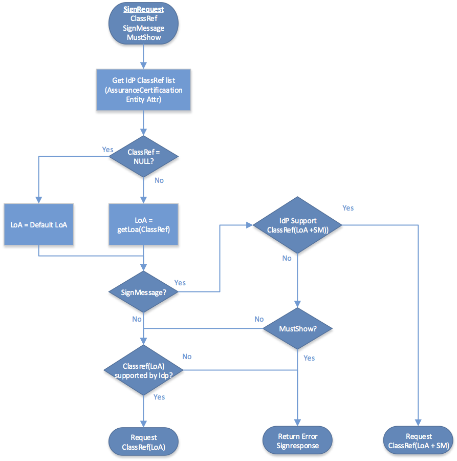

</img>

#  Implementation Profile for using OASIS DSS in Central Signing Services

### Version 1.3 - 2017-06-09 - *draft version*

*ELN-0607-v1.3*

---

## Table of Contents

1. [**Introduction**](#introduction)

    1.1. [Terminology](#terminology)

    1.2. [Requirement key words](#requirement-key-words)

    1.3. [Name space references](#name-space-references)

    1.4. [Identification](#identification)

    1.5. [Structure](#structure)

2. [**Sign request and response messages**](#sign-request-and-response-messages)

    2.1. [Sign Requests](#sign-requests)

    2.1.1. [Signature on sign requests](#signature-on-sign-requests)

    2.1.2. [Data to be signed](#data-to-be-signed)

    2.1.3. [DSS extension](#dss-extension)

    2.1.3.1. [Version](#version)

    2.1.3.2. [Conditions](#conditions)

    2.1.3.3. [Signer](#signer)

    2.1.3.4. [IdentityProvider](#identityprovider)

    2.1.3.5. [Sign Requester](#sign-requester)

    2.1.3.6 [SignService](#signservice)

    2.1.3.7. [RequestedSignatureAlgorithm](#requestedsignaturealgorithm)

    2.1.3.8. [SignMessage](#signmessage)

    2.1.3.8.1. [SignMessage element](#signmessage-element)

    2.1.3.8.2. [Requesting Identity Provider to display SignMessage](#requesting-identity-provider-to-display-signmessage)

    2.1.3.9. [CertRequestProperties](#certrequestproperties)

    2.1.3.9.1. [AuthnContextClassRef](#authncontextclassref)

    2.1.3.9.2. [RequestedCertAttributes](#requestedcertattributes)

    2.2. [Sign Responses](#sign-responses)

    2.2.1. [Signature on sign responses](#signature-on-sign-responses)

    2.2.2. [Sign response status information](#sign-response-status-information)

    2.2.3. [Generated signature](#generated-signature)

    2.2.4. [DSS Extension](#dss-extension)

    2.2.4.1. [Version](#version)

    2.2.4.2. [ResponseTime](#responsetime)

    2.2.4.3. [Request](#request)

    2.2.4.4. [SignerAssertionInfo](#signerassertioninfo)

    2.2.4.5. [SignatureCertificateChain](#signaturecertificatechain)

3. [**HTTP POST binding**](#http-post-binding)

    3.1. [Message exchange model](#message-exchange-model)

    3.1.1. [Sign request XHTML form](#sign-request-xhtml-form)

    3.1.2. [Sign Response XHTML form](#sign-response-xhtml-form)

4. [**References**](#references)

    4.1. [Normative References](#normative-references)

    4.2. [Informative References](#informative-references)

5. [**Changes between versions**](#changes-between-versions)

<a name="introduction"></a>
## 1. Introduction

This document specifies an implementation profile for exchange of sign
requests and responses using the OASIS DSS protocol \[[DSS](#dss)\], enhanced by
the DSS Extensions for Federated Central Signing Services \[[DSS-Ext](#dss-ext)\].

Section 2 defines the sign request and response messages and section 3
defines the transport of these messages using HTTP POST.

<a name="terminology"></a>
### 1.1. Terminology

Term | Defined meaning
--- | ---
**User** | The entity requested to sign a document
**Requesting Service** | The service requesting the signature on a particular document by a particular user
**Signing Service** | A centralized service that manages the process to authenticate the user that has been requested to sign a document, and the process to obtain the user’s signature on the requested document.

<a name="requirement-key-words"></a>
### 1.2. Requirement key words

The key words **MUST**, **MUST** **NOT**, **REQUIRED**, **SHALL**,
**SHALL** **NOT**, **SHOULD**, **SHOULD** **NOT**, **RECOMMENDED**,
**MAY**, and **OPTIONAL** are to be interpreted as described in
\[[RFC2119](#rfc2119)\].

These keywords are capitalized when used to unambiguously specify
requirements over protocol features and behavior that affect the
interoperability and security of implementations. When these words are
not capitalized, they are meant in their natural-language sense.

<a name="name-space-references"></a>
### 1.3. Name space references

Conventional XML namespace prefixes are used throughout the listings in
this specification to stand for their respective namespaces as follows,
whether or not a namespace declaration is present in the example:

Prefix | XML Namespace | Comments
--- | --- | ---
csig | `http://id.elegnamnden.se/csig/1.1/dss-ext/ns` | For the DSS extension namespace \[[DSS-Ext](#dss-ext)\] (default namespace).
dss | `urn:oasis:names:tc:dss:1.0:core:schema` | The DSS core namespace \[[DSS](#dss)\].
ds | `http://www.w3.org/2000/09/xmldsig\#` | The XML Signature Syntax and Processing specification \[[XMLSig](#xmlsig)\] and its governing schema \[[XMLSig-XSD](#xmlsig-xsd)\].
saml | `urn:oasis:names:tc:SAML:2.0:assertion` | The SAML V2.0 assertion namespace, defined in the schema \[[SAML-XSD](#saml-xsd)\].
  ------------ ---------------------------------------------- -------------------------------------------------------------------------------------------

<a name="identification"></a>
### 1.4. Identification

The following URI identifier identifies this profile:

> **`http://id.elegnamnden.se/csig/1.1/dss-ext/profile`**

<a name="structure"></a>
### 1.5. Structure

This specification uses the following typographical conventions in text:
`<EidElement>`, `<ns:ForeignElement>`, `Attribute`, **Datatype**,
`OtherCode`.

<a name="sign-request-and-response-messages"></a>
## 2. Sign request and response messages

This section defines a profile for sign requests and responses using the
OASIS DSS standard \[[DSS](#dss)\] in combination with “DSS extensions for
Federated Central Signing Services” \[[DSS-Ext](#dss-ext)\].

In the following sections the OASIS DSS standard is referred to as “DSS”
and the DSS extensions are referred to as “DSS-Ext”.

Conformance with this implementation profile requires full conformance
with DSS and DSS-Ext. In case of conflict between DSS-Ext and DSS,
DSS-Ext is the normative one. In case of differences between this
implementation profile and DSS-Ext, this implementation profile is the
normative one.

<a name="sign-requests"></a>
### 2.1. Sign Requests

Sign requests are carried in a `<dss:SignRequest>` element according to requirements and conditions of the following subsections.

The `<dss:SignRequest>` element MUST have a Profile attribute with the value `http://id.elegnamnden.se/csig/1.1/dss-ext/profile`, which specifies conformance to this implementation profile.

The `<dss:SignRequest>` element MUST have a `RequestID` attribute with a value that uniquely identifies this request. The `RequestID` value MUST be a random generated value with at least 128 bit entropy and a length of at least 20 bytes.


<a name="signature-on-sign-requests"></a>
#### 2.1.1. Signature on sign requests

Sign requests MUST be signed. The signature MUST have a Same-Document URI-Reference (URI=””) to ensure that the signature covers the complete `<dss:SignRequest>` element.

The resulting `<ds:Signature>` element MUST be placed inside the `<dss:OptionalInputs>` element in accordance with section 5 of [[DSS-Ext](#dss-ext)].

The Signature Service MUST NOT process the sign request unless the signature of the sign request can be authenticated as originating from a legitimate Requesting Service.

<a name="data-to-be-signed"></a>
#### 2.1.2. Data to be signed

A representation of the document to be signed MUST be provided in accordance with section 4.1 of DSS-Ext.

Data to be signed MUST be provided in a `<SignTaskData> `element.

The `<SignTasks>` element MAY contain one or more `<SignTaskData>` elements, representing one or more requested signatures.

<a name="dss-extension"></a>
#### 2.1.3. DSS extension

The `<dss:OptionalInput>` element of the sign request MUST contain a
`<SignRequestExtension>` element according to requirements and
conditions of the following subsections.

<a name="version"></a>
##### 2.1.3.1. Version

The version of the DSS-Ext specification MUST be version 1.1 (default).
The version attribute MUST either be absent (default value) or MUST
specify the value “1.1”.

<a name="conditions"></a>
##### 2.1.3.2. Conditions

A `<saml:Conditions>` element MUST be present. This element MUST NOT
contain any information in addition to what is defined in section 3.1 of
\[[DSS-Ext](#dss-ext)\].

<a name="signer"></a>
##### 2.1.3.3. Signer

The `<Signer>` element MUST contain at least the SAML attributes
that are necessary in order to uniquely identify the signer. The present
attributes MUST match the attributes that are provided for this signer
when authenticating the signer using the Identity Provider specified in
the `<IdentityProvider>` element.

The Signing Service MUST match all attribute values provided in the
`<Signer>` element with SAML attributes provided for this signer
subject in a valid assertion obtained from the specified Identity
Provider.

If any of the attributes specified in the `<Signer>` element cannot
be found or matched with a corresponding attribute value from an
obtained assertion from the specified Identity Provider, the Signing
Service MUST reject the sign request.

<a name="identityprovider"></a>
##### 2.1.3.4. IdentityProvider

This element MUST be present, specifying the SAML EntityID of the
Identity Provider that MUST be used to authenticate the signer. The
Signing Service MUST NOT generate the requested signature unless the
signer is successfully authenticated through this Identity Provider.

<a name="sign-requester"></a>
##### 2.1.3.5. Sign Requester

This element MUST be present, specifying the identity of the Requesting
Service in the form of its SAML EntityID.

<a name="signservice"></a>
##### 2.1.3.6 SignService

This element MUST be present, specifying the SAML EntityID of the
Signing Service that is the target of this sign request.

<a name="requestedsignaturealgorithm"></a>
##### 2.1.3.7. RequestedSignatureAlgorithm

This element MAY be present, specifying a URI that identifies a
signature algorithm that the Requesting Service prefers to be used when
generating the requested signature.

When this element is absent, the default signing algorithm is RSA with
SHA-256.

<a name="signmessage"></a>
##### 2.1.3.8. SignMessage

<a name="signmessage-element"></a>
###### 2.1.3.8.1. SignMessage element

This element MAY be present to provide information that the Identity
Provider MAY display for the user before obtaining the user’s consent to
sign. The message MAY be provided in clear text or in encrypted form.
The attribute `MustShow` MUST be set to `true` if the Identity Provider is
required to show this message to the user. When the message is provided
in encrypted form, the `DisplayEntity` attribute MUST include the EntityID
of the Identity Provider holding the private decryption key. The
encryption key included in the metadata of the identified Identity
Provider SHOULD be used to encrypt the message.

The message MUST be encoded using UTF-8 and MUST be using one of the
formats plain text, HTML or markdown. The appropriate MIME type must be
declared in the `MimeType` attribute.

For messages in HTML format, the message MUST NOT contain tags and
attributes for each tag other than those listed in the following table:

| HTML Tags | Type | Allowed attributes |
| --- | --- | --- |
| h1, h2, h3, h4 | Headings | style |
| div, span, p | Section | style |
| table, tr, td | Table | style |
| b, strong | Highlight | style |
| i, u, br | Format | &nbsp; |
| ol, ul, li | List | &nbsp; | 

Allowed HTML entities for character replacement SHALL be restricted to
`amp`, `gt`, `lt`, `quot` and `nbsp` (in the form `&entity-name;`).

HTML messages MUST NOT contain any URI references to data outside of the
message and MUST NOT contain any JavaScript in any form.

<a name="requesting-identity-provider-to-display-signmessage"></a>
###### 2.1.3.8.2. Requesting Identity Provider to display SignMessage

The means through which the Service Provider requests the Identity
Provider to display a sign message is defined in the “Deployment Profile
for the Swedish eID Framework” \[Eid-Profile\] section 7.2.1.

In addition to these requirements the Signature Service MUST apply the
following process to determine which `AuthnContextClassRef` URI to include
in the `AuthnRequest` sent to the Identity Provider when authenticating
the user for signing:

</img>

The input data for the process is:

Input | Description
--- | ---
`ClassRef` | The `AuthnContextClassRef` specified in the sign request as `CertRequestProperties`.
`SignMessage` | The `SignMessage` element in the sign request.
`MustShow` | The `MustShow` attribute of the `SignMessage` element.
`AuthnContextClassRef` URIs | URIs supported by the Identity Provider, retrieved from the Identity Provider's metadata.

Functions and values:

Functions | Values
--- | ---
**getLoa**(ClassRef) | Returns the Level of Assurance represented by a specified AuthnContextClassRef URI.
**ClassRef**(LoA) | The default AuthnContextClassRef URI specified for a specified LoA with no requirements to display a sign message.
**ClassRef**(LoA + SM) | The AuthnContextClassRef URI specified for a specified LoA with requirements to display a sign message.
Default LoA | The default Level of Assurance according to the governing policy.

***Process steps:***

1. Determine requested LoA (Level of Assurance) by either:
  1.  Get the LoA from the `ClassRef` URI specified in the sign request, if present, or
  2.  if the `ClassRef` from the sign request is absent (NULL) then
        use the default LoA.

2. If no `SignMessage` is present in the sign request:
  1.  Request **ClassRef**(LoA) as `RequestedAuthnContext` if supported by the Identity Provider.
  2.  Otherwise fail signing and return an error sign response, indicating a request failure (the requested LoA was inconsistent with the specified Identity Provider).
  3.  End.

3. If the Identity Provider supports **ClassRef**(LoA + SM):
  1.  Include sign message in the `AuthnRequest` to the Identity Provider.
  2.  Request **ClassRef**(LoA + SM) as `RequestedAuthnContext`.
  3.  End.

4.  If `MustShow` = `true`:
  1.  Fail signing and return an error sign response, indicating a
        request failure (a sign message included a requirement to be
        displayed but the specified Identity Provider does not support
        display of sign messages).
  2.  End.

5.  Proceed with normal authentication:
  1.  Include sign message in the `AuthnRequest` to the Identity
        Provider (just in case the Identity Provider can make use of
        this information anyway).
  2.  Request **ClassRef**(LoA) as `RequestedAuthnContext` if supported
        by the Identity Provider.
  3.  Otherwise fail signing and return an error sign response,
        indicating a request failure (the requested LoA was inconsistent
        with the specified Identity Provider).
  4.  End.

Note: The process defined above requires that the **ClassRef**(LoA + SM)
MUST be used when the sign request includes a sign message and the
Identity Provider has declared that it supports display of sign
messages. This allows a requesting service to send a sign request with a
sign message with `MustShow` = `false` and still obtain proof of display of
sign message from those Identity Providers that do support display of
sign messages.

<a name="certrequestproperties"></a>
##### 2.1.3.9. CertRequestProperties

This element MAY be present to provide requested properties of generated
signature certificates according with section 3.1.1 of \[[DSS-Ext](#dss-ext)\].

When the `CertType` attribute is present with a value of `QC/SSCD` the signature service MUST request authentication in accordance with the “Deployment Profile for the Swedish eID Framework” [Eid-Profile] section 7.2.2, or reject the request.

<a name="authncontextclassref"></a>
###### 2.1.3.9.1. AuthnContextClassRef

This element MAY be present to specify the Level of Assurance required
in order to issue the signing certificate. This element serves only to
determine the Level of Assurance required. See further the algorithm to
determine the `AuthnContextClassRef` URI specified as
`RequestedAuthnContext` in section 2.1.3.8.2.

<a name="requestedcertattributes"></a>
###### 2.1.3.9.2. RequestedCertAttributes

This element MAY be present to specify any number of attributes that the
Requesting Service requires or requests to be included as a
representation of the subject in the signature certificate that is
generated with the requested signature.

The Signature Service MUST NOT generate the requested signature unless
it can obtain attribute values from an authoritative source for all
requested attributes that is marked as “required”. The Signature service
SHOULD attempt to provide all “requested” attributes.

The Signing Service MAY use an Attribute Authority as complementary
source to obtain requested attribute values, as long as the identity
assertion provided by the specified Identity Provider is sufficient to
uniquely identify the signer. The Sign Requester MAY provide one or more
SAML EntityID identifiers of Attribute Authorities in
`<AttributeAuthority>` elements, which could be used to obtain an
attribute value for the requested attribute.

It is left to local policy of the Signature Service whether it accepts
any `DefaultValue` attribute value for any requested attributes as being
provided by an authoritative source. If a `DefaultValue` is accepted as
authoritative, it MUST NOT conflict with any attributes received by the
specified Identity Provider or Attribute Authority when authenticating
the signer. If the requested attribute is provided by the Identity
Provider or any Attribute Authority used by the Signing Service, then
these values MUST be used over the `DefaultValue`.

<a name="sign-responses"></a>
### 2.2. Sign Responses

Sign responses are carried in a `<dss:SignResponse>` element
according to requirements and conditions of the following subsections.

The `<dss:SignResponse>` element MUST have a Profile attribute with
the value `http://id.elegnamnden.se/csig/1.1/dss-ext/profile`, which
specifies conformance to this implementation profile.

The `<dss:SignResponse>` element MUST have a `RequestID` attribute
with a value that is identical to the sign request that is being
serviced through this sign response.

<a name="signature-on-sign-responses"></a>
#### 2.2.1. Signature on sign responses

Sign responses MUST be signed. The signature MUST have a Same-Document
URI-Reference (URI=””) to ensure that the signature covers the complete
`<dss:SignResponse>` element.

The resulting `<ds:Signature>` element MUST be placed inside the
`<dss:OptionalOutputs>` element in accordance with section 5 of
\[DSS-Ext\].

<a name="sign-response-status-information"></a>
#### 2.2.2. Sign response status information

Implementations of this specification MUST return a
`<dss:ResultMajor>` value and MAY return a `<dss:ResultMinor>`
value. Implementations of this specification are released from the
requirement to return any of the listed values of
`<dss:ResultMinor>`, specified in the DSS standard, when returning
the `<dss:ResultMajor>` value
`urn:oasis:names:tc:dss:1.0:resultmajor:Success`, since all the listed
`<dss:ResultMinor>` values relates to signature validation and not
signature creation.

With the exception above, the response values defined in section 2.6 of
the DSS standard, amended by status identifiers defined in section 3.1.7
of \[[Eid-Registry](#eid-registry)\], SHOULD be used.

<a name="generated-signature"></a>
#### 2.2.3. Generated signature

The generated signature result data SHALL be provided in
`<SignTaskData>` element according to section 4.1.1 of \[[DSS-Ext](#dss-ext)\].

One `<SignTaskData>` element shall be provided for each successfully
generated signature as a result of the corresponding request.

<a name="dss-extension"></a>
#### 2.2.4. DSS Extension

The `<dss:OptionalInput>` element of the sign response MUST contain
a `<SignResponseExtension>` element according to requirements and
conditions of the following subsections.

<a name="version"></a>
##### 2.2.4.1. Version

The version of the DSS-Ext specification MUST be version 1.1 (default).
The version attribute MUST either be absent (default value) or MUST
specify the value “1.1”.

<a name="responsetime"></a>
##### 2.2.4.2. ResponseTime

The `<ResponseTime>` element MUST be present in the response.

<a name="request"></a>
##### 2.2.4.3. Request

The `<Request>` element MUST be present in all responses where a
corresponding request could be parsed and authenticated to originate
from a legitimate requester.

<a name="signerassertioninfo"></a>
##### 2.2.4.4. SignerAssertionInfo

The `<SignerAssertionInfo>` element MUST be present if the signer
has been successfully authenticated using the specified Identity
Provider. The present `<ContextInfo>` child element MUST include an
`<AssertionRef>` child element. The `<AssertionRef>` child
element MUST contain the value of the `ID` attribute of the root element
of the SAML assertion used to authenticate the signer.

<a name="signaturecertificatechain"></a>
##### 2.2.4.5. SignatureCertificateChain

The `<SignatureCertificateChain>` element MUST be present if a
certificate was issued to the signer. This element MUST provide a
complete chain of certificate up to a self-signed root certificate.

All signature values according to section 2.2.3 MUST be verifiable using
the signer certificate provided in this element.

<a name="http-post-binding"></a>
## 3. HTTP POST binding

This section specifies the protocol binding
for transport of sign request and sign response using HTTP POST. This
protocol binding implements the message exchange model in section 3.1.

This process is technically equivalent to the procedures implemented by
SAML HTTP POST bindings \[[SAML2Bind](#saml2bind)\], section 3.5.

<a name="message-exchange-model"></a>
### 3.1. Message exchange model

Sign request and response messages are exchanged between the Requesting
Service and the Signing Service with the user acting as an intermediary
through a user agent (typically a web browser) according to the
following message flow:

</img>


1.  The user agent initiates the signing process by an HTTP request to
    the Service Provider, for example caused by the user clicking on
    some button on a web page.
    
2.  The Service Provider responds to the user agent with an XHTML form,
    containing a Base64 encoded sign request.

3.  A JavaScript in the XHTML form causes the user agent to send the
    sign request to the Signing Service using HTTP POST.

4.  The user interacts with the Signing Service to complete the
    requested signature.

5.  The Signing Service responds to the user agent with an XHTML form,
    containing a Base64 encoded sign response.

6.  A JavaScript in the XHTML form causes the user agent to send the
    sign response to the Service Provider using HTTP POST.

7.  The Service Provider processes the sign response and a confirmation
    or status message is returned to the user agent.

The steps 1,4 and 7 are part of the service infrastructure and are
outside the scope of this HTTP POST binding specification.

<a name="sign-request-xhtml-form"></a>
#### 3.1.1. Sign request XHTML form

The sign request XHTML form SHALL have functional properties that are
equivalent to the following implementation example:

````
<?xml version='1.0' encoding='UTF-8'?>
<!DOCTYPE html PUBLIC '-//W3C//DTD XHTML 1.1//EN' 'http://www.w3.org/TR/xhtml11/DTD/xhtml11.dtd'>
<html xmlns='http://www.w3.org/1999/xhtml' xml:lang='en'>
<body onload='document.forms[0].submit()'>
  <noscript>
    <p><strong>Note:</strong> Since your browser does not support JavaScript,
    you must press the Continue button once to proceed.</p>
  </noscript>
  <form action='https://eid2csig.konki.se/signrequest' method='post'>
    <div>
      <input type='hidden' name='Binding' value='POST/XML/1.0'/>
      <input type='hidden' name='RelayState' value='56345145a482995d'/>
      <input type='hidden' name='EidSignRequest' value='PD94bWw…WVzdD4='/>
    </div>
    <noscript>
      <div>
        <input type='submit' value='Continue'/>
      </div>
    </noscript>
  </form>
</body>
````

The form’s action attribute specifies the URL to the Signing Service and
the form MUST have a method attribute with the value “post”.

The form MUST provide the following parameters:

Parameter | Value
--- | ---
Binding | “POST/XML/1.0” Identifying implementation of this binding specification
RelayState | This parameter MUST contain the value of the RequestID attribute of the dss:SignRequest element that is present in the base64 encoded sign request.
EidSignRequest | Base64 encoded sign request.

<a name="sign-response-xhtml-form"></a>
##### 3.1.2. Sign Response XHTML form

The sign response XHTML form SHALL have functional properties that are
equivalent to the following implementation example:

````
<?xml version='1.0' encoding='UTF-8'?>
<!DOCTYPE html PUBLIC '-//W3C//DTD XHTML 1.1//EN' 'http://www.w3.org/TR/xhtml11/DTD/xhtml11.dtd'>
<html xmlns='http://www.w3.org/1999/xhtml' xml:lang='en'>
<body onload='document.forms[0].submit()'>
  <noscript>
    <p><strong>Note:</strong> Since your browser does not support JavaScript,
    you must press the Continue button once to proceed.</p>
  </noscript>
  <form action='https://sp.example.com/sigResponseHandler' method='post'>
    <div>
      <input type='hidden' name='Binding' value='POST/XML/1.0'/>
      <input type='hidden' name='RelayState' value='56345145a482995d'/>
      <input type='hidden' name=' EidSignResponse' value='PD94bWw…WVzdD4='/>
    </div>
    <noscript>
      <div>
        <input type='submit' value='Continue'/>
      </div>
    </noscript>
  </form>
</body>
````

The form’s action attribute specifies the URL to the requesting Service
Provider. This URL MUST specify a URL from the
`<saml:AudienceRestriction>` element that was provided in the
corresponding sign request. The form MUST have a method attribute with
the value “post”.

The form MUST provide the following parameters:

Parameter | Value
--- | ---
Binding | “POST/XML/1.0” Identifying implementation of this binding specification
RelayState | This parameter MUST contain the value of the RequestID attribute of the `<dss:SignResponse>` element that is present in the base64 encoded sign request.
EidSignResponse | Base64 encoded sign response.

<a name="references"></a>
## 4. References

<a name="normative-references"></a>
### 4.1. Normative References

<a name="eid-profile"></a>**[Eid-Profile]**
> [Deployment Profile for the Swedish eID Framework](http://elegnamnden.github.io/technical-framework/latest/ELN-0602_-_Deployment_Profile_for_the_Swedish_eID_Framework.html).

<a name="rfc2119"></a>**[RFC2119]**
>[Bradner, S., Key words for use in RFCs to Indicate Requirement Levels, March 1997.](http://www.ietf.org/rfc/rfc2119.txt)

<a name="dss-ext"></a>**[DSS-Ext]**
> [DSS Extension for Federated Central Signing Services](http://elegnamnden.github.io/technical-framework/latest/ELN-0609_-_DSS_Extension_for_Federated_Signing_Services.html).

<a name="dss"></a>**[DSS]**
> [OASIS Standard - Digital Signature Service Core Protocols, Elements, and Bindings Version 1.0, April 11, 2007](https://docs.oasis-open.org/dss/v1.0/oasis-dss-core-spec-v1.0-os.html).

<a name="saml-xsd"></a>**[SAML-XSD]**
> S. Cantor et al., SAML assertions schema. OASIS SSTC, March 2005. Document ID: saml-schema-assertion-2.0. See <http://www.oasisopen.org/committees/security/>.

<a name="xmlsig"></a>**[XMLSig]**
> D. Eastlake et al, XML-Signature Syntax and Processing, W3C Recommendation, February 2002.

<a name="xmlsig-xsd"></a>**[XMLSig-XSD]**
> XML Signature Schema. World Wide Web Consortium. See <http://www.w3.org/TR/2000/CR-xmldsig-core-20001031/xmldsig-coreschema.xsd>.

<a name="eid-registry"></a>**[Eid-Registry]**
> [Registry for identifiers assigned by the Swedish e-identification
> board](http://elegnamnden.github.io/technical-framework/latest/ELN-0603_-_Registry_for_Identifiers.html).

<a name="informative-references"></a>
### 4.2. Informative References

<a name="saml2bind"></a>**[SAML2Bind]**
> [OASIS Standard, Bindings for the OASIS Security Assertion Markup Language (SAML) V2.0, March 2005.](http://docs.oasis-open.org/security/saml/v2.0/saml-bindings-2.0-os.pdf)

<a name="changes-between-versions"></a>
## 5. Changes between versions

**Changes between version 1.2 and version 1.3:**

- In section 2.1.3.9. CertRequestProperties: Added requirement to adapt authentication request procedures when the requested signature is a qualified electronic signature.

**Changes between version 1.1 and version 1.2:**

- In section 2.2.2, a reference to section 3.1.5 in \[Eid-Registry\] was changed to section 3.1.7.

**Changes between version 1.0 and version 1.1:**

-   This profile now refers to version 1.1 of the “DSS Extensions for
    Federated Central Signing Services” specification.

-   Changes were made to section 2.1.3.8, “SignMessage”, in order to
    define usage of the `<SignMessage>` element.

-   The URI identifier that identifies this profile has been changed
    from `http://id.elegnamnden.se/csig/1.0/eid2-dss/profile` to
    `http://id.elegnamnden.se/csig/1.1/dss-ext/profile`.
