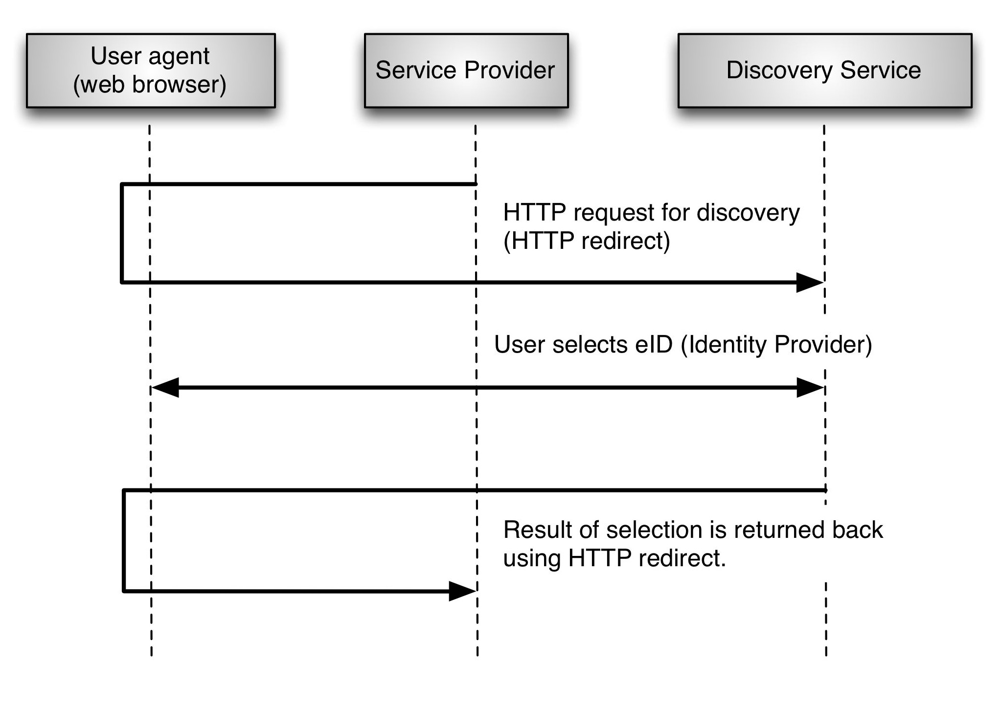
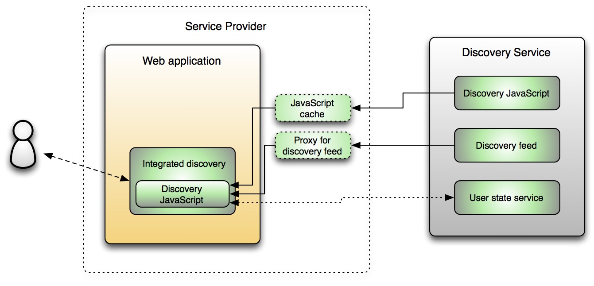

</img>

# Discovery within the Swedish eID Framework

### <del>Version 1.1 - 2015-05-06</del>
<del>*ELN-0610-v1.1*</del>

---

###  The current version of this specification has been deprecated and is no longer part of the Swedish eID Framework. An updated version of this specification may be introduced to future versions of the Swedish eID Framework.

---

1. [**Introduction**](#introduction)

2. [**Discovery Service Logic**](#discovery-service-logic)

    2.1. [Matching of Identity Providers](#matching-of-identity-providers)
    
    2.2. [User State and Remembered Choices](#user-state-and-remembered-choices)

3. [**Discovery according to “Identity Provider Discovery Service Protocol and Profile”**](#discovery-according-to)

    3.1. [Discovery Response Addresses](#discovery-response-addresses)

    3.2. [Silent Discovery Service](#silent-discovery-service)

    3.3. [The Discovery Service and Mobile Devices](#the-discovery-service-and-mobile-devices)

4. [**Integrating the Discovery Service in the Service Provider Application**](#integrating-the-ds-in-the-sp)

    4.1. [Architecture and Dependencies](#architecture-and-dependencies)

    4.2. [Step-by-step Integration](#step-by-step-integration)

    4.2.1. [Inclusion of Required Resources](#inclusion-of-required-resources)

    4.2.2. [Laying out the Discovery Area](#laying-out-the-discovery-area)

    4.2.3. [Invoking the doDiscovery Function and Handling the Result](#invoking-the-dodiscovery-function-and-handling-the-result)

5. [**Discovery Service JavaScript API**](#discovery-service-javascript-api)

    5.1. [Namespace and dependencies](#namespace-and-dependencies)

    5.2. [Functions](#functions)

    5.2.1. [getVersion](#getversion)

    5.2.2. [doDiscovery](#dodiscovery)

    5.3. [Objects](#objects)

    5.3.1. [DiscoverySettings](#discoverysettings)

    5.3.2. [uiConfig](#uiconfig)

    5.3.3. [userStateConfig](#userstateconfig)

    5.3.4. [DiscoveryError](#discoveryerror)

6. [**References**](#references)

7. [**Changes between versions**](#changes-between-versions)

---

## 1. Introduction

The Swedish eID Framework comprises a Discovery Service that has as its
purpose to supply Service Providers with user selected Identity
Providers for authentication within the federation. In other words, the
process where the end users chooses which Identity Provider, or eID, to
use for authentication is not performed at the Service Provider, but
instead handled by the Discovery Service.

There are several reasons for centralizing this process:

-   Matching logic – The Discovery Service performs filtering based on
    Service Provider requirements and Identity Provider capabilities to
    find a set of Identity Providers that meet the criteria mandated by
    the calling Service Provider.

-   User state – By using a centralized service for discovery the end
    user may have his or hers selected Identity Provider(s) saved in
    between sessions, and the information may be used for any Service
    Provider within the federation.

-   Common look and feel – Since all Service Providers within the
    federation share the same Discovery Service the end users will be
    met by the same user interface when choosing the method to use while
    logging in, independently of which service they are trying to reach.

The Discovery Service for the Swedish eID Framework can be utilized in
two different ways; either by directing the end user to the Discovery
Service according to “Identity Provider Discovery Service Protocol and
Profile”,
\[[IdpDisco](http://docs.oasis-open.org/security/saml/Post2.0/sstc-saml-idp-discovery.pdf)\],
or by importing a JavaScript from the Discovery Service and let the end
user choose Identity Provider locally at the Service Provider. The logic
executed is the same for the two methods, the differences are how the
Service Provider integrates against the Discovery Service and how the
end user performs his or hers choice. These two methods are described
later in this document. But first, let’s go through some of the logic of
the Discovery Service.

## 2. Discovery Service Logic

Independently of how a Service Provider integrates to the Discovery
Service, the same type of underlying functionality and logic is
provided. This chapter describes this logic in detail.

### 2.1. Matching of Identity Providers

The Discovery Service makes use of Entity Categories defined in metadata
to match Service Provider requirements against Identity Provider
capabilities, and to come up with a list of Identity Providers to
display for the user. The specification “Entity Categories for the
Swedish eID Framework”, \[Eid2EntCat\], defines the different entity
categories and their meaning. Chapter 1.4 of \[Eid2EntCat\] also
specifies the algorithm used by the Discovery Service to match Identity
Providers. This chapter elaborates on this algorithm and also provides a
few examples.

A Service Provider that invokes the discovery process provides its
unique entityID as a parameter. The Discovery Service will use this to
obtain the Service Provider requirements from the federation metadata.
Given the Service Provider metadata entry, the following steps will be
taken to filter out which Identity Providers that meet the Service
Provider requirements:

-   Given all Entity Categories of the type “Service Entity Category”
    declared by the Service Provider, the Discovery Service will match
    all Identity Providers that defines **at least one** of those
    categories.

-   Given all Entity Categories of the type “Service Property” declared
    by the Service Provider, the Discovery Service will match the
    Identity Providers that defines **all** of those categories.

**Example 1**:

Suppose that Service Provider X has a metadata entry that defines the
following entity categories:

| Service Provider X   | | 
| ------------------ |--- |
| Service Entity Categories | loa3-pnr (`http://id.elegnamnden.se/ec/1.0/loa3-pnr`) |
| Service Properties | - |

Then, suppose that we have the following Identity Providers declared
in the federation metadata:

| Identity Provider A |     |
| ------------------------ | --- |
| Service Entity Categories | loa3-pnr (`http://id.elegnamnden.se/ec/1.0/loa3-pnr`), loa4-pnr (`http://id.elegnamnden.se/ec/1.0/loa4-pnr`) |
| Service Properties | mobile-auth (`http://id.elegnamnden.se/sprop/1.0/mobile-auth`) |
| **Identity Provider B** |  |
| Service Entity Categories | loa3-pnr (`http://id.elegnamnden.se/ec/1.0/loa3-pnr`) |
| Service Properties | - |
| **Identity Provider C** | |
| Service Entity Categories | loa4-pnr (`http://id.elegnamnden.se/ec/1.0/loa4-pnr`) |
| Service Properties | mobile-auth (`http://id.elegnamnden.se/sprop/1.0/mobile-auth`) |

In this example the Discovery Service will match Identity Providers A
and B, since they both define the loa3-pnr Service Entity Category.
Identify Provider C will not be used since it only defines loa4-pnr.

**Example 2**:

Now, assume that we have another Service Provider, Y, which has the
following metadata entry:

| Service Provider Y |   |
| ------------------------ | --- |
| Service Entity Categories | loa3-pnr (`http://id.elegnamnden.se/ec/1.0/loa3-pnr`) |
| Service Properties | mobile-auth (`http://id.elegnamnden.se/sprop/1.0/mobile-auth`) |

Given the same Identity Providers from the previous example, the
Discovery Service will only match Identity Provider A since it defines
loa3-pnr and all the Service Properties defined by the Service
Provider (mobile-auth). Identity Provider B meets the requirements
regarding the Service Entity Categories, but does not define the
required Service Property.

### 2.2. User State and Remembered Choices
---------------------------------

The Discovery Service is shared between all the Service Providers within
the federation. This enables end users to have pre-selected eIDs (or
Identity Providers) for the Discovery Service, and to utilize this when
logging on to any Service Provider within the federation. The obvious
advantage for the end user is that he or she just may confirm a previous
choice when prompted to choose an eID instead of selecting from a list
of possible eIDs/Identity Providers. These “remembered choices”, or
pre-selected eIDs, are saved between sessions and are valid until the
user clears them. Note that the state is saved in the end users web
browser as HTML 5 web storage, or using cookies. No central repository
is used.

Note: In the case a pre-selected Identity Provider cannot be used it is
“greyed out”, and a full list of possible Identity Providers will be
displayed. This will typically occur when the Discovery Service matching
logic rules out the pre-selected Identity Provider because it does not
meet the Service Provider requirements (see above).

The Discovery Service also maintains a session state for the “active”
choice. This means that per browser session, the Discovery Service keeps
track of which eID that was chosen, and may further simplify the end
user’s choice if he or she visits several Service Providers within the
same browser session. The session state may also be used in Single Sign
On-scenarios or in the case where the Service Provider invokes the
discovery process using the `isPassive` flag (see [3.2](#silent-discovery-service), “[Silent Discovery
Service](#silent-discovery-service)”).

## 3. Discovery according to “Identity Provider Discovery Service Protocol and Profile”

The OASIS specification, ”Identity Provider Discovery Service Protocol
and Profile”,
\[[IdpDisco](http://docs.oasis-open.org/security/saml/Post2.0/sstc-saml-idp-discovery.pdf)\],
describes how a central Discovery Service presents a user interface for
end users where they make their choice of which Identity Provider to use
while authenticating to the Service Provider. This section further
explains how integration against the Discovery Service of the Swedish
eID Framework is made.

The integration is simple. Basically the Service Provider redirects the
user to the Discovery Service along with a parameter telling which
Service Provider that is requesting the user to make a choice. Based on
the calling Service Provider’s entityID the Discovery Service may
perform its filtering of Identity Providers (as described in chapter
[2.1](#matching-of-identity-providers), “[Matching of Identity Providers](#matching-of-identity-providers)”, above) and display a list of
Identity Providers for the user to choose from. Once the user has made
his or hers choice, the user agent (i.e., the web browser) is redirected
back to the Service Provider, this time with a parameter telling the
Service Provider the entityID of the selected Identity Provider. Based
on this information the Service Provider may continue the authentication
process by building an authentication request and sending the end user
to the selected Identity Provider.

The flow diagram below illustrates the interaction between the user, the
Service Provider and the Discovery Service.

> Figure 1: Web flow during discovery using the central Discovery

The specification
(\[[IdpDisco](http://docs.oasis-open.org/security/saml/Post2.0/sstc-saml-idp-discovery.pdf)\])
states a number of additional parameters that may be passed in the
request to the Discovery Service. These parameters are thoroughly
described by the specification, but we still need to clarify some issues
in the chapters below.

### 3.1. Discovery Response Addresses

How does the Discovery Service know where to redirect the user when he
or she has chosen which Identity Provider to use?

In order to avoid unauthorized use of the Swedish eID Discovery Service
all return addresses must be registered in the federation metadata. It
is mandated that a Service Provider wanting to perform discovery
according to
\[[IdpDisco](http://docs.oasis-open.org/security/saml/Post2.0/sstc-saml-idp-discovery.pdf)\]
must supply at least one address in its metadata entry using the
`<idpdisc:DiscoveryResponse>` element. If several addresses are
given, the address having index 1 is regarded to be the default response
address.

This means that the `return` parameter specified in section 2.4.1 of
\[[IdpDisco](http://docs.oasis-open.org/security/saml/Post2.0/sstc-saml-idp-discovery.pdf)\]
only has to be supplied if the Service Provider wishes to have the
response sent back to an address other than the default response
address. In these cases the value of the `return` parameter must still be
one of the `DiscoveryResponse` addresses from the Service Provider
metadata.

### 3.2. Silent Discovery Service

Chapter [2.2](#user-state-and-remembered-choices), “[User State and Remembered Choices](#user-state-and-remembered-choices)”, describes how the
Swedish eID Discovery Service handles the user discovery state. A
Service Provider may use the `isPassive` parameter and set its value to
`true` in order to find out if the user already has selected an Identity
Provider for the current web session1. This feature may be useful in
Single Sign On-scenarios, but care should be taken not to confuse the
end user. It is essential that the end users understand that they are
being logged in to a Service Provider.

> \[1\]: In this context we refer to a web session and mean that the user still has his or her web browser (window) open since the last time a choice of Identity Provider was made.

### 3.3. The Discovery Service and Mobile Devices

A Service Provider web application may be adapted for use by mobile
devices such as smart phones. In these cases the Service Provider most
likely wants that the end user to be displayed a user interface suitable
for mobile devices also when the user is directed to the Discovery
Service.

In the case that Discovery Service is used according to “Identity
Provider Discovery Service Protocol and Profile”,
\[[IdpDisco](http://docs.oasis-open.org/security/saml/Post2.0/sstc-saml-idp-discovery.pdf)\],
the Discovery Service interface is using responsive design and is
adjusted according to the size of the browser window irrespective of
whether a mobile device is used or not.

The Discovery Service will try to detect the type of user agent (i.e.,
web browser) to determine if a mobile device is used. If a mobile device
is used then the Discovery Service at first only displays Identity
Providers adapted for mobile devices (i.e. Identity Providers that
define mobile-auth Service Property among its Entity Categories in its
metadata entry) in the list of possible eIDs (Identity Providers)2.
The end user can always choose to display all Identity Providers that
meet the requirements.

See “Entity Categories for the Swedish eID Framework”, \[Eid2EntCat\],
for more information about the use of entity categories.

> \[2\]: By including the mobile-auth category an Identity Provider asserts that it supports both authentication using a mobile device and that it will display a user interface suitable for mobile devices.

## 4. Integrating the Discovery Service in the Service Provider Application

This chapter describes how a Service Provider may integrate the use of the Discovery Service in its own web application instead of, as described above, directing the end user to the central Discovery Service. The reasons a Service Provider may wish to use this kind of integration may be:

-   To provide a more tight integration, and to avoid redirecting the
    end user to the central Discovery Service.

-   To integrate other authentication methods, not available via the
    federation, in the list of the authentication methods that are
    displayed to the end user.

-   To use local caching of Discovery Service feeds and scripts to
    eliminate the dependency on the third party services being
    responsive.

### 4.1. Architecture and Dependencies

The Discovery Service in the federation for Swedish eID is constructed in such a way that it offers the possibility to access its logic, which is entirely built in JavaScript, without actually directing the end user to the Discovery Service web application. Instead the Service Provider web application may download the Discovery Service Java­Scrip­t and use it locally. The picture below illustrates this:

> Figure 2: Discovery Service architecture.

The figure illustrates how the Service Provider may choose to implement caches, or proxies, for resources that are downloaded from the Discovery Service. This is not a requirement, but may be useful to obtain a homogenous solution where no direct dependencies exist to the central Discovery Service.

However, there is one dependency that is not possible to cache. That is the built in connection between the JavaScript and the “user state service” residing on its own domain within the central Discovery Service. This service is responsible of handling user state and remembered choices (as described in chapter [2.2](#user-state-and-remembered-choices) above), however it is possible to disable these features (see [5.3.3](#userstateconfig), “[userStateConfig](#userstateconfig)”).
Should this connection not be responsive, the discovery process will still work, but without the feature of currently selected eID or pre-selected eIDs.

The Discovery Service stores currently selected eID and pre-selected eIDs in the end users web browser as HTML 5 web storage or by using cookies by embedding an iFrame that makes calls (using *PostMessage*) to the "user state service" (no central repository is used). In addition to this, the Discovery Service by default also saves the pre-selected eIDs (as HTML 5 web storage or using cookies) in the Service Providers own domain to enable remembered choices for web browsers where third-party data is blocked. The above functionality can be disabled using the userStateConfig parameter (see chapter [5.3.3](#userstateconfig)).

The listing below describes all dependencies that a Service Provider wanting to provide local discovery needs to address:

<dl>
<dt>Discovery JavaScript</dt>
<dd>
The JavaScript that is responsible of the discovery logic (matching of possible Identity Providers to display and handling of user state) as well as rendering of the HTML that is inserted in the Service Provider’s web page. 

There may be several versions of the JavaScript available for usage, and a Service Provider should ensure to use a version that it has tested before use. Different versions of the JavaScript may be incompatible. The first digit of the three-digit version number indicates whether a backward incompatible API-change has been made (see chapter <a href="#getVersion">5.2.1</a>, “<a href="#getVersion">getVersion</a>”, below). The filename of a Discovery JavaScript always contains the major digit of the version, e.g. <code>anvisning-2.js</code>.

The JavaScript API is described in chapter <a href="#Discovery-Service-JavaScript-API">5</a> below.
</dd>
<dt>Discovery feed</dt>
<dd>
A JSON-feed that is available from the Discovery Service. This feed corresponds to the current state of the federation metadata. The JavaScript uses this information internally, and the Service Provider itself does not have to interpret it, only make sure that the JavaScript function has access to it.

As already mentioned, the Service Provider may cache this feed locally in order to provide a quicker and more homogenous integration. When doing so, the Service Provider cache functionality should ensure to update this cache frequently.
</dd>

<dt>Style sheet (CSS)</dt>
<dd>
A Service Provider making use of locally integrated discovery must include a CSS-file that is used by the JavaScript while it generates the HTML that is inserted in the Service Provider web page. A Service Provider may choose to point at the CSS residing at the Discovery Service, or to download this file and make alterations to it in order to customize the “look-and-feel” of the user interface.
</dd>
</dt> 
</dl>

**Note**: All required addresses (URLs) and filenames are listed under “Technical Infrastructure” on the Swedish eID federation web site.

### 4.2. Step-by-step Integration

This chapter describes, in a step-by-step manner, how a Service Provider integrates the Discovery Service on a web page of the Service Provider web application. See chapter [5](#discovery-service-javascript-api), “[Discovery Service JavaScript API](#discovery-service-javascript-api)”, for a full specification of the JavaScript functions and objects mentioned
in this chapter.

#### 4.2.1. Inclusion of Required Resources

In order for a Service Provider to be able to utilize the Discovery Service logic in its own web application, it needs to include the required resources.

The example below illustrates how a web page imports a locally stored version of the Discovery Service Ja­va­Script and a modified CSS-file that contains the same CSS-definitions as the CSS-file of the Discovery Service. The example also illustrates how a JavaScript variable, `localDiscoveryFeed`, is declared and assigned the address to the local
proxy/cache function holding the Discovery feed.

    ...    
    <!-- Include the modified CSS for doDiscovery -->
    <link href="styles/discovery.css" rel="stylesheet" type="text/css"/>
    ...
    <!-- Include the locally cached Discovery JavaScript -->
    
    ...    
    
    ...
    
    ...
    
    <body>
    ...
        

        

#### 4.2.3. Invoking the doDiscovery Function and Handling the Result

In order to display the Discovery user interface the `doDiscovery` function must be invoked. Depending on how the Service Provider web application is structured this may be done after the user has clicked “Log in”, or after the HTML page has been loaded.

This section presents a simple example where the `doDiscovery` function is called when the HTML page has finished
loading. When the result, i.e., the selected Identity Provider, is received, this is given to a Service Provider resource that is
responsible of handling the user authentication. The error handling of this is example is simple – an error is displayed and the user may retry. For a full specification of the Discovery JavaScript, see chapter [5](#discovery-service-javascript-api), “[Discovery Service JavaScript API](#discovery-service-javascript-api)”.

    ...
    <!-- Inclusions of JavaScript and CSS-files ... -->
    ...
    
    
    ...
    <body>
      ...    
      <!-- This is here where the HTML rendered by doDiscovery() will be inserted. -->
      

      

      ...
    
      

      

      ...

## 5. Discovery Service JavaScript API

This section describes the Discovery Service JavaScript API for the Swedish eID framework.

### 5.1. Namespace and dependencies

All functions within the Discovery Service JavaScript API for the Swedish eID framework are declared in a namespace called `discoSveleg`. The reason for this is to encapsulate the functions and to avoid polluting a Service Provider’s JavaScript namespace.

The Discovery Service JavaScript makes use of jQuery, which is created under its own alias, `discoSvelegJq`, to avoid conflicts with other versions of jQuery that the service may be using. If the Service Provider’s already has included a version of jQuery, the Discovery Service JavaScript may make use of this library3.

> \[3\]: Provided that it is a valid version. The versions accepted by the Discovery Service JavaScript are listed on the federation web site.

### 5.2. Functions

#### 5.2.1. getVersion

**Function:** `getVersion`

**Parameters:** None

**Returns:** A string on the format: *major.minor.fix*.

**Throws:** Never

**Description**: This function will return the current version of the downloaded JavaScript API. Changes of the *major*-digit of the returned string indicate backwards-incompatible changes.

A Service Provider should ensure to use the most recent version of the JavaScript API.

#### 5.2.2. doDiscovery

**Function:** `doDiscovery`

**Parameters:**    

* `DiscoverySettings` – An object containing configuration and callback functions for use by the function. See [5.3.1](#discoverysettings) below.

**Returns:** Void function. Results are reported asynchronously using the callback functions of the `DiscoverySettings` objects.

  **Throws:** If no error callback function is provided, the function will throw objects of the type `DiscoveryError` ([5.3.4](#discoveryerror)) as exceptions to indicate errors.

  **Description**:  The main function of the API, which will create the user interface for the end user to make his or her selection of the desired Identity Provider.

The rendered HTML code will be inserted into the HTML element as specified by `DiscoverySettings.includeElement`, and results will be reported to the callback function as specified by `DiscoverySettings.resultCallback` or `DiscoverySettings.errorCallback` in case of errors.

### 5.3. Objects

#### 5.3.1. DiscoverySettings

The `DiscoverySettings` object contains key-value pairs that are used to control how the HTML-code is generated and how results are reported back to the calling application.

| Object property | Required | Description |
| :------ | :---: | :--- |
| `entityID` | ✓ |  The entityID of the Service Provider that is invoking `doDiscovery`. This is the unique ID for the Service Provider within the federation. |
| `includeElement` | ✓ | The ID of the HTML element to which `doDiscovery` will insert the generated user interface. This inner content of this element will be replaced with the contents generated by the Discovery Service. |
| `dsProxies` | ✓ | A list of one or more addresses to the discovery feed. The `doDiscovery` function will attempt to use the first address in the list, and move on to the next in the list in case of errors. |
| `uiConfig` | | Configuration parameters for how the user interface should be rendered see [5.3.2](#uiconfig) below. |
| `userStateConfig` | | Configuration parameters for how remembered choices should be used, see [5.3.3](#userstateconfig) below. |
| `resultCallback` | ✓ | The callback function that will be used by the `doDiscovery` function to return the result of the user selection. The function should accept one argument which will be a string holding the entityID of the selected Identity Provider. If the user did not make a selection the result callback will be invoked with a null-argument. |
| `errorCallback` | ✓ | The callback function that will be used by the `doDiscovery` function to report errors. The function should accept one argument that will be a DiscoveryError object, see [5.3.4](#discoveryerror) below. |

#### 5.3.2. uiConfig

The `uiConfig` object is a name-value object containing properties that determines how to display the Discovery user interface.

| Object property | Default value | Description |
| --- | --- | --- |
| `isPassive` | `false` | A boolean variable that corresponds to the `isPassive` parameter specified in \[[IdpDisco](http://docs.oasis-open.org/security/saml/Post2.0/sstc-saml-idp-discovery.pdf)\]. If set, the `doDiscovery` function will attempt to derive the user selection without displaying the interface to the user. This is done by controlling if the user already has performed a selection in the current web session (see [2.2](#user-state-and-remembered-choices), “[User State and Remembered Choices](#user-state-and-remembered-choices)”) and if so, the Identity Provider’s entityID will be returned. If no previous selection exists the `doDiscovery` function will invoke the result callback with a `null` argument. |
| `language` | sv | This property specifies the preferred language of the user interface that is created by the `doDiscovery` function. If the Identity Provider information that is displayed in the user interface does not exist (in federation metadata) in the required language, Swedish will be used. The language is specified with two or three letters according to IANA Subtag Registry \[[IANA-Lang](http://www.iana.org/assignments/language-subtag-registry/language-subtag-registry)\], e.g. “en” for English and “sv” for Swedish. |
| `minimal` | `false` | Shows a minimal graphical user interface, which means that only the list of Identity Providers is shown and no other information such as headers and help links will be displayed. Setting the `minimal` property to `true` is equivalent to setting the following settings to `false`: `showCancelButton`, `showFilter`, `showHeader`, `showHelpLinks`, `showLanguageSetting`, `showRememberChoiceSetting`. If the `minimal` property is set to `true`, any assignment of the above parameters will be ignored. |
| `showCancelButton` | `false`| Shows or hides the Cancel-button of the user interface being rendered. Depending on how the user interface is integrated in the Service Provider web site, the use of a Cancel-button may or may not be desired. |
| `showFilter` | `true` | Shows or hides the filtering-functionality in the Discovery Service. The filtering-functionality handles alternative ways to show available Identity Providers, for example all Identity Providers or only Identity Providers for mobile devices. The filtering functionality also includes the search bar if a large number of Identity Providers are displayed. |
| `showHeader` | `true` | This property specifies if the header of the Discovery Service shall be shown. The header includes the name of the Service Provider, the Swedish eID logo and the heading “Select Swedish eID”. |
| `showLanguageSetting` | `false` | Shows or hides the settings section for “Change language”. This setting is used to control the language of the Discovery Service user interface. |
| `showRememberChoiceSetting` | `true` | Shows or hides the settings section for “Remember my selection”. This setting is used to control if an end users choice of Identity Provider shall be remembered between sessions. |
| `showHelpLinks` | `true` | Indicates whether help links should be included in the generated user interface. These links typically points to informational resources about eID and the federation. |

#### 5.3.3. userStateConfig

The `userStateConfig` object is a name-value object containing properties that determines how user state and remembered choices should be used (see [2.2](#user-state-and-remembered-choices), “[User State and Remembered Choices](#user-state-and-remembered-choices)” and [4.1](#architecture-and-dependencies), “[Architecture and Dependencies](#architecture-and-dependencies)”).

| Object property | Default value | Description |
| --- | --- | --- |
| `disableInOwnDomain` | `false` | This property decides if storage of remembered choices in the own domain shall be disabled. |
| `disablePreSelection` | `false` | This property decides if pre-selected eIDs shall be disabled. |
| `disableCurrentSelection` | `false` | This property decides if the current selection (per browser session) shall be disabled. |

#### 5.3.4. DiscoveryError

The `DiscoveryError` is an object that is used as an argument for the `DiscoverySettings.errorCallback` and as an exception object for the `doDiscovery` function.

| Object property | Description |
| --- | --- |
| `errorCode` | The numeric error code identifying the error. See below for a listing of possible error codes. |
| `description` | A textual description of the error. This text will always be in English and is of a technical nature. It should therefore never be displayed for an end user. |

**Error code list:**

| Error code |  Caused by |
| :---: | :--- |
| 100 | Bad call to `doDiscovery`. The `DiscoverySettings` object is missing. |
| 101 | The `entityID` property of the `DiscoverySettings` object is not supplied. |
| 102 | The `includeElement` property of the `DiscoverySettings` object is not supplied. |
| 103 | The `dsProxies` property of the `DiscoverySettings` object is not supplied or is an empty array. |
| 104 | No `resultCallback` specified the `DiscoverySettings` object. |
| 105 | The invoking Service Provider lacks required fields in its metadata representation. |
| 106 | The entityID of the invoking Service Provider does not exist in the federation metadata. |
| 107 | The address, or addresses, specified in `DiscoverySettings.dsProxies` cannot be reached. |
| 108 | No `errorCallback` specified the `DiscoverySettings` object. |
| 109 | No Identity Providers are available for selection. Normally this error occurs when the Service Provider requirements of its metadata leads to that no matching Identity Providers are found. Instead of displaying an empty list to “choose” from, the Discovery Service will treat this as an error, and let the invoking Service Provider handle the situation. |

## 6. References

**\[IdpDisco\]**
> [OASIS Committee Specification, Identity Provider Discovery Service
> Protocol and Profile, March
> 2008](http://docs.oasis-open.org/security/saml/Post2.0/sstc-saml-idp-discovery.pdf).

**\[Eid2EntCat\]**
> Entity Categories for the Swedish eID Framework.

**\[IANA-Lang\]**
> <http://www.iana.org/assignments/language-subtag-registry/language-subtag-registry>.

## 7. Changes between versions

**Changes between version 1.0 and version 1.1:**

-   Chapter 3.3, “The Discovery Service and Mobile Devices”, was updated
    to reflect changes in how mobile devices are handled.

-   The code examples of chapter 4, “Integrating the Discovery Service
    in the Service Provider Application”, has been updated.

-   A number of new JavaScript-properties regarding User
    Interface-configuration have been added to chapter 5.3.2,
    “uiConfig”.

-   The JavaScript-property userStateDomain has been removed from
    chapter 5.3.3, “userStateConfig”.

